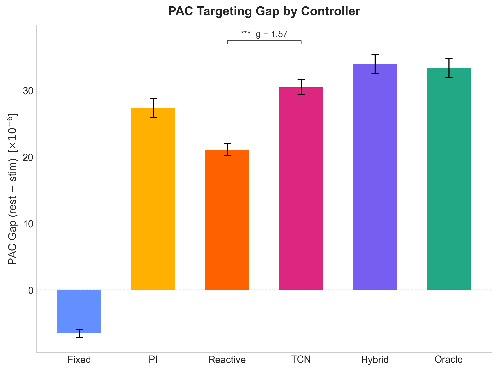
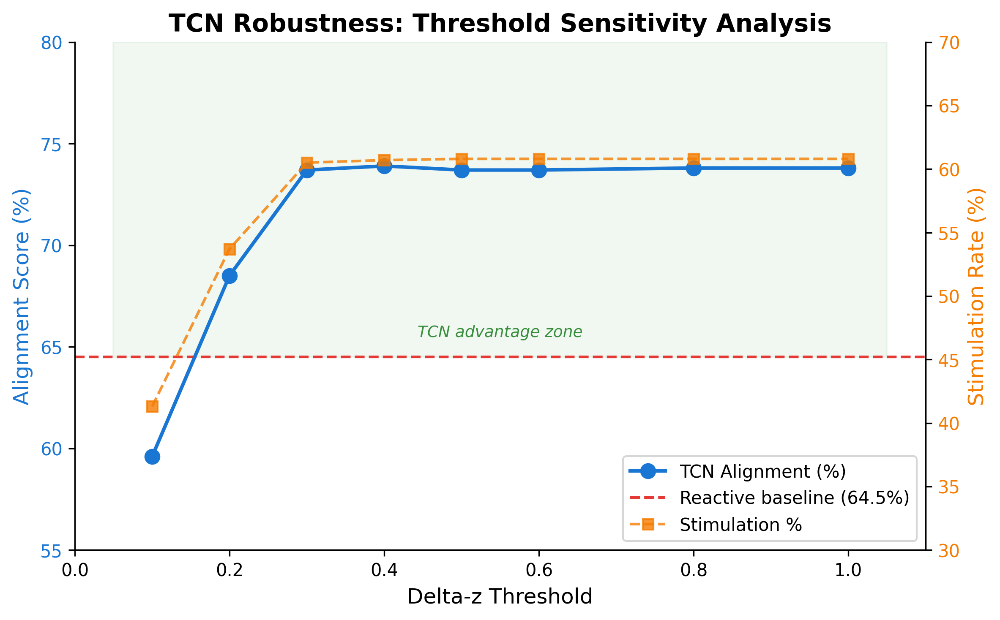
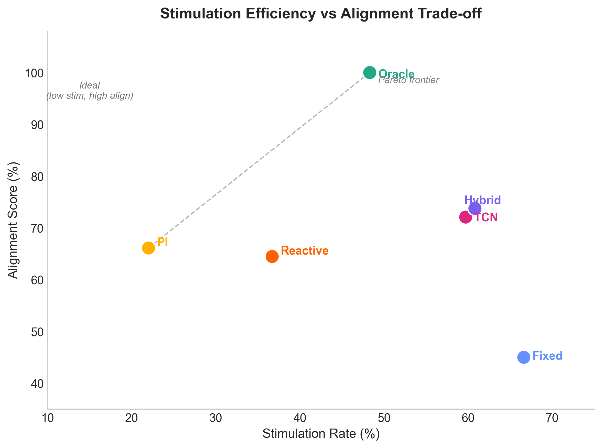

# Supplementary Materials

## Personalized Deep Learning Model for Closed-Loop 40 Hz Entrainment to Optimize Theta-Gamma Coupling in Alzheimer's Disease

**Amaar Chughtai**

---

## Table S1: TCN Performance at ts=1 (Raw Targets) vs ts=5 (Smoothed Targets)

The horizon sweep presented in Figure 4 of the main text uses a causal target smoothing window of ts=5 to characterize the comparative advantage of the TCN over baselines across prediction horizons. The deployed closed-loop controller checkpoint uses ts=1 (raw, unsmoothed PAC targets). These configurations measure different quantities and their results are not directly comparable.

| Configuration | Target Definition | 5s Horizon Test R² | Best Val R² | Note |
|--------------|------------------|--------------------|-------------|------|
| ts=5 (horizon sweep) | Smoothed PAC (5-window causal average) | 0.254 (TCN) | — | Used in Figure 4 to characterize comparative advantage |
| ts=1 (deployed checkpoint) | Raw PAC (unsmoothed) | 0.170 | 0.411 | Used in all closed-loop controller experiments |

The ts=5 configuration inflates R² because consecutive target values share 4 of 5 data points, making them highly autocorrelated. The ts=1 configuration predicts raw PAC dynamics and represents the honest metric for the deployed model. The horizon sweep figure (Figure 4 in main text) uses ts=5 for visual clarity of the comparative advantage; Table S1 presents the deployed model's performance under raw target conditions.

**Interpretation:** The key insight is that even at ts=1 (Test R²=0.170), the TCN provides directional forecasts of sufficient accuracy to produce large alignment improvements (Hedges' g=+1.31) over reactive threshold control. For binary stimulation timing decisions (STIMULATE vs REST vs MAINTAIN), directional accuracy matters more than absolute point-prediction accuracy. The TCN's Pearson r=0.433 on raw targets indicates strong rank correlation sufficient to support proactive control decisions.

---

## Figure S1: PAC Targeting Gap by Controller

*Figure S1.* PAC targeting gap (mean PAC during rest windows minus mean PAC during stimulation windows) for each controller strategy, in dimensionless Modulation Index units (×10⁻⁶). A positive gap indicates the controller correctly concentrates stimulation during low-PAC periods. The Fixed Schedule exhibits a negative gap (−6.6 ×10⁻⁶), indicating it stimulates preferentially during high-PAC periods — the inverse of the therapeutic goal. The TCN Predictive controller achieves a gap of +30.5 ×10⁻⁶, compared to +21.1 ×10⁻⁶ for Reactive Threshold and +33.3 ×10⁻⁶ for the Alignment Oracle. The TCN's PAC targeting gap reaches 91.6% of the oracle upper bound, demonstrating near-optimal targeting of low-PAC windows for stimulation delivery (N=35 subjects; values are means across subjects; error bars indicate ±1 standard error).

---

## Figure S2: Threshold Sensitivity Analysis

*Figure S2.* Alignment (%) and Low-PAC Stimulation Rate (%) for the TCN Predictive controller as a function of the z-score threshold parameter (δz), ranging from 0.1 to 1.0 in steps of 0.1. The reactive threshold baseline (64.5% alignment, 51.7% Low-PAC Stim Rate) is shown as a horizontal dashed reference line. The TCN consistently outperforms the reactive baseline at all thresholds δz≥0.2. Performance plateaus in the range δz=0.3–1.0, indicating the predictive advantage is not an artifact of threshold tuning. Only at δz=0.1 (where frequent state-switching occurs) does TCN alignment approach the reactive baseline (59.6%). The operating threshold δz=0.3 (used in the primary controller comparison) is marked with a vertical indicator.

---

## Figure S3: Stimulation Rate vs Alignment Trade-off

*Figure S3.* Pareto frontier showing the trade-off between stimulation rate (x-axis, % of session time with stimulation active) and alignment (y-axis, % of stimulation correctly targeted to low-PAC periods). Each point represents a controller strategy. The Alignment Oracle achieves perfect alignment (100%) at 48.3% stimulation rate, establishing the theoretical maximum. The TCN Predictive controller achieves the best Pareto position among non-oracle controllers: 72.1% alignment at 59.7% stimulation rate. The Reactive Threshold controller achieves lower alignment (64.5%) at lower stimulation rate (36.7%). The Fixed Schedule (66.6% stimulation, 45.0% alignment) falls below both adaptive controllers on both axes simultaneously, demonstrating that fixed-schedule protocols are dominated — they use more stimulation while achieving worse targeting.

---

## Table S2: Complete Effect Sizes for All Pairwise Controller Comparisons

Effect sizes (Hedges' g) with 95% confidence intervals (large-sample normal approximation, g +/- 1.96 x SE) for all pairwise controller comparisons, computed over N=35 subjects. Statistical significance is from two-sided Wilcoxon signed-rank tests (non-parametric paired comparison). All effect sizes are from the primary closed-loop controller evaluation using ts=1 (raw PAC) ground-truth inputs.

### TCN Predictive vs Fixed Schedule (N=35)

| Metric | TCN Mean | Fixed Mean | Hedges' g | 95% CI | p-value | Interpretation |
|--------|----------|------------|-----------|--------|---------|----------------|
| Stimulation Hit Rate | 2.75% | 7.36% | −3.62 | [−4.58, −2.65] | <0.001 | Large |
| Wasted Stimulation % | 97.3% | 92.6% | +3.62 | [+2.65, +4.58] | <0.001 | Large |
| Stimulation Time % | 40.7% | 66.6% | −3.53 | [−4.49, −2.58] | <0.001 | Large |
| Mean PAC Change After Stim | 2.77×10⁻⁶ | 2.00×10⁻⁶ | +0.20 | [−0.27, +0.67] | 0.501 | Negligible |

*Note: Stimulation Hit Rate is defined as the fraction of stimulation windows that produced measurable PAC improvement in the subsequent window. Lower Wasted Stimulation % is better; the Fixed Schedule wastes 92.6% of stimulation events.*

### TCN Predictive vs Reactive Threshold (N=35)

| Metric | TCN Mean | Reactive Mean | Hedges' g | 95% CI | p-value | Interpretation |
|--------|----------|---------------|-----------|--------|---------|----------------|
| Stimulation Hit Rate | 2.75% | 0.04% | +2.27 | [+1.56, +2.97] | <0.001 | Large |
| Wasted Stimulation % | 97.3% | 99.96% | −2.27 | [−2.97, −1.56] | <0.001 | Large |
| Stimulation Time % | 40.7% | 36.7% | +0.53 | [+0.04, +1.01] | 0.015 | Medium |
| Mean PAC Change After Stim | 2.77×10⁻⁶ | 0.99×10⁻⁶ | +0.79 | [+0.28, +1.29] | 0.001 | Medium |

*Primary comparison reported in main text. Additional metrics from the alignment and PAC gap analysis (Alignment: g=+1.31 [+0.75, +1.87], p<0.001; Low-PAC Stim Rate: g=+4.47 [+3.33, +5.62], p<0.001; PAC Gap: g=+1.57 [+0.98, +2.17], p<0.001) are computed from the primary validation protocol described in Section 4.7.*

### TCN Predictive vs PI Controller (N=35)

| Metric | TCN Mean | PI Mean | Hedges' g | 95% CI | p-value | Interpretation |
|--------|----------|---------|-----------|--------|---------|----------------|
| Stimulation Hit Rate | 2.75% | 7.72% | −1.99 | [−2.65, −1.33] | <0.001 | Large |
| Wasted Stimulation % | 97.3% | 92.3% | +0.84 | [+0.33, +1.35] | <0.001 | Large |
| Stimulation Time % | 40.7% | 22.0% | +1.12 | [+0.59, +1.66] | <0.001 | Large |
| Mean PAC Change After Stim | 2.77×10⁻⁶ | 4.01×10⁻⁶ | −0.67 | [−1.17, −0.18] | 0.001 | Medium |

*The PI Controller has the highest High-PAC Rest Rate (93.6%) but the lowest Low-PAC Stim Rate (38.6%) among non-oracle controllers, reflecting extreme conservatism in stimulation delivery.*

---

## Table S3: Fatigue Sensitivity Results

Stimulation efficiency (mean PAC per unit stimulation time, scaled by ×10⁵ for readability) for the Fixed Schedule and TCN Predictive controller across six fatigue severity levels. Fatigue is modeled as an exponential decay in coupling response amplitude with cumulative stimulation exposure (FatigueAwareSimulator). Results are from closed-loop simulation and complement the primary real-data results in Section 6.2.

| Fatigue Rate | Fatigue Level | Fixed Efficiency | Adaptive Efficiency | Gain (%) | Stim Saving (pp) | p-value |
|-------------|--------------|-----------------|--------------------|---------|--------------------|---------|
| 0.000 | None | 5.381 | 5.401 | +0.4% | 17.2 pp | 0.492 (n.s.) |
| 0.004 | Mild | 5.294 | 5.361 | +1.3% | 17.3 pp | 0.020 |
| 0.008 | Mild-Moderate | 5.217 | 5.329 | +2.1% | 17.6 pp | 0.010 |
| 0.015 | Moderate | 5.101 | 5.231 | +2.6% | 16.6 pp | 0.010 |
| 0.025 | Severe | 4.968 | 5.184 | +4.3% | 16.3 pp | 0.002 |
| 0.040 | High | 4.819 | 5.092 | +5.7% | 14.5 pp | 0.010 |

*pp = percentage points. Efficiency metric = mean PAC during stimulation divided by stimulation fraction. p-values from Wilcoxon signed-rank tests (N=10 trials per condition). The efficiency advantage of adaptive control increases monotonically with fatigue severity, indicating the approach is most valuable precisely when habituation is a clinical concern. Stimulation savings remain consistent across fatigue levels (14.5–17.6 pp reduction relative to fixed schedule), confirming that adaptive control achieves efficiency gains through better targeting rather than arbitrary reduction in stimulation frequency.*

---

## Additional Methodological Details

### EEGNet Architecture (Static PAC Estimator)

The EEGNet regression model (1,457 parameters) processes 2-second EEG windows of shape (batch, 1, 7, 500):

- **Block 1:** Temporal convolution (8 filters, 64-sample kernel) → Depthwise spatial convolution (depth multiplier D=2, 7 channels → 16 feature maps) → Batch normalization → ELU → Average pooling (pool=4) → Dropout($p$=0.5)
- **Block 2:** Depthwise separable convolution (16 pointwise filters, 16-sample kernel) → Batch normalization → ELU → Average pooling (pool=8) → Dropout($p$=0.5)
- **Head:** Linear (flattened → scalar PAC prediction)
- **Training:** MSE loss, Adam (lr=0.001), ReduceLROnPlateau (patience=5), early stopping (patience=15), gradient clipping (max_norm=1.0). Test R²=0.287.

### MultiscaleCausalTCN Architecture (Temporal PAC Forecaster)

The TCN (31,043 parameters) processes sequences of shape (batch, T=20, F=73):

- **Input projection:** Linear (73→64) → LayerNorm → SiLU
- **Causal TCN blocks (×4):** Causal depthwise-separable conv (kernel=3, dilations [1,2,4,8]) → GroupNorm(1, channels) [equivalent to LayerNorm] → SiLU → Dropout(0.2) → Residual connection → SiLU (double-SiLU pattern)
- **Attention pooling:** Learned scalar weights over T=20 time steps → weighted sum
- **Dual regression heads:** Linear → SiLU → Dropout($p$=0.2) → Linear (×2 for y_future and y_delta)
- **Training:** Huber loss (δ=1.0), AdamW (lr=1×10⁻³, wd=1×10⁻³), ReduceLROnPlateau (mode=max, patience=5), early stopping (patience=20 epochs on validation R²). Best checkpoint epoch 53. Test R²=0.170 (ts=1, 5s horizon).

### Causal Feature Vector (73 dimensions)

| Feature Group | Dimensions | Description |
|---------------|-----------|-------------|
| Spectral band power | 28 | 4 bands (theta, alpha, beta, gamma) × 7 frontal channels (Welch PSD, current window) |
| Theta-gamma ratio | 7 | Per-channel theta/gamma power ratio |
| PAC-structure features | 21 | 3 per channel (phase resultant length, amplitude variance, preferred phase bin) |
| Global statistics | 5 | Mean/std of theta power, mean/std of gamma power, mean theta-gamma ratio |
| PAC history | 7 | Current PAC, causal moving averages (2,4,8,16 windows), first-order and 4-step differences |
| Stimulation context | 5 | Binary stim state, time-since-switch (normalized), stim fraction (20s window), cycle phase (sin/cos) |

All features extracted causally with no future information access. All features z-score normalized using training-set statistics.

### Controller Decision Logic

All controllers share a common personalization layer: a 30-second circular rolling buffer maintains subject-specific PAC baseline statistics (mean µ and standard deviation σ). Minimum 10 samples required before baseline is activated. Decision rule:

| z-score condition | Action | Rationale |
|------------------|--------|-----------|
| z < −0.5 | STIMULATE | PAC below personal baseline; apply entrainment |
| z > +0.5 | REST | PAC above baseline; avoid habituation |
| −0.5 ≤ z ≤ +0.5 | MAINTAIN | PAC near baseline; continue current state |

Hysteresis: minimum 5-second hold time in each state before transitions are considered.

For the TCN Predictive controller, z is computed from the TCN's 5-second-ahead PAC forecast rather than the current observed PAC, enabling proactive rather than reactive decision-making.

---

*End of Supplementary Materials.*
