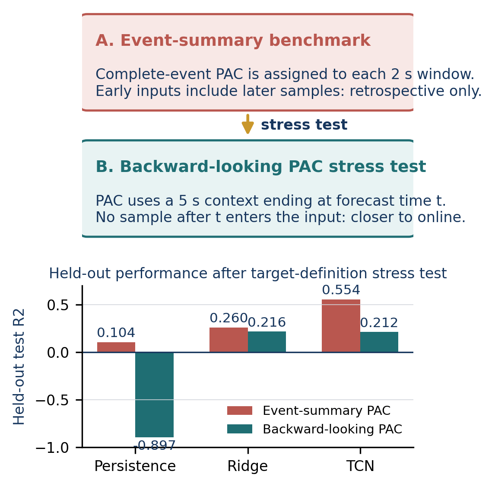

# Stress-Testing Cross-Participant PAC Forecasting for Adaptive 40 Hz Auditory Entrainment

**Author:** Amaar M. Chughtai  
**Affiliation:** Valley Christian High School, San Jose, California, United States  
**Contact:** amaardevx@gmail.com

## Abstract

Fixed schedules for 40 Hz auditory stimulation cannot adapt to short-term changes in measured
neural response. This retrospective computational study asks whether theta-gamma phase-amplitude
coupling, or PAC, histories and recorded protocol context support cross-participant forecasting,
and how the conclusion changes when PAC labels are made closer to online availability. Recordings
from 35 participants in OpenNeuro `ds005048` were processed using seven frontal channels and split
by participant into 24 training, 5 validation, and 6 held-out test participants. In an initial
event-summary benchmark, a compact 12-feature TCN improved held-out test R-squared from minus 0.025
for a 73-feature candidate set to 0.558. Across five seeds, mean R-squared was 0.606 versus 0.104
for persistence. However, complete-event PAC summaries assigned back to constituent windows include
samples acquired later in the same period. A stress test therefore recomputed PAC from five-second
backward-looking contexts. Unique held-out targets increased from 104 to 2,678 and adjacent target
repetition fell from 96.2 percent to zero. TCN R-squared decreased from 0.554 to 0.212 and did not
exceed Ridge regression at 0.216. Separately, offline controller replay exposed a
targeting-specificity tradeoff rather than a balanced improvement. The findings identify target
definition and compact feature design as central constraints for a prospective adaptive system.

**Keywords:** auditory entrainment, phase-amplitude coupling, EEG, temporal convolutional network,
adaptive stimulation, retrospective replay

## I. Introduction

Gamma-frequency neural activity has become an active research area in neurodegeneration. In 5XFAD
mice, experimentally induced 40 Hz activity reduced amyloid burden and altered microglial response
[1]. Human electroencephalography (EEG) studies have also investigated non-invasive auditory
gamma-frequency entrainment. In a memory-clinic cohort, Lahijanian et al. found increased 40 Hz EEG
power and frontoparietal synchrony during auditory entrainment [2]. These findings motivate tools
for characterizing neural response, but they do not establish that an adaptive auditory controller
improves clinical outcomes.

Many stimulation protocols use fixed timing. A fixed schedule is simple, reproducible, and easy to
evaluate, but it cannot respond to within-session changes in measured brain state. Closed-loop
neuromodulation research instead seeks to adjust stimulation from measured biomarkers [4]. A
predictive controller could act before a coupling decline rather than after a threshold
has already been crossed. That objective requires a forecast that generalizes across participants,
an online biomarker estimator, and a controller whose decision rule balances stimulation during
low-coupling periods against rest during high-coupling periods.

The broader engineering design separates current-biomarker estimation from future-state forecasting.
This paper isolates the temporal forecasting stage with stored PAC labels, then stress-tests whether
its conclusions survive a target definition that is closer to online availability. A broader
prototype includes a compact raw-EEG estimator, but that estimator is not composed with the
forecasting or replay validation loop reported here.

This study focuses on three questions:

1. Can a compact temporal model forecast theta-gamma PAC five seconds ahead in the stored series on
   participants excluded from training?
2. Does the apparent forecasting advantage survive when PAC is recomputed from backward-looking
   contexts instead of complete-event summaries?
3. When the forecast is inserted into a retrospective controller replay, does it improve balanced
   decision alignment relative to fixed and reactive strategies?

Feature ablation identified a compact representation as the strongest event-summary input set. A
12-feature representation of PAC trajectory and stimulation context generalized substantially
better than a larger 73-feature candidate representation. The backward-looking stress test then
exposed a more consequential limitation: the TCN's advantage over a linear baseline did not persist.
Controller replay exposed a separate calibration tradeoff. These negative findings sharpen the
engineering requirements for a prospective system.

## II. Data and Methods

### A. Dataset and Preprocessing

The analysis used the Brain Imaging Data Structure (BIDS)-formatted OpenNeuro dataset `ds005048`
version `1.0.1` [3]. The local release contains auditory-entrainment EEG
recordings from 35 participants recruited from a memory clinic, including participants with normal
cognition, mild cognitive impairment, and Alzheimer's disease classifications. The source study
recorded 19 monopolar EEG channels at 250 Hz during 40 Hz auditory stimulation trials interleaved
with rest periods [2].

Seven frontal channels were selected: `Fp1`, `Fp2`, `F7`, `F3`, `Fz`, `F4`, and `F8`. The source
study reports Makoto-pipeline preprocessing, including a `1 Hz` high-pass filter, `50 Hz`
line-noise removal, artifact subspace reconstruction, average rereferencing, and ICA-based
component rejection [2]. Released sidecar files independently report the `1 Hz` high-pass filter,
`50 Hz` notch filter, and average reference. The local processing stage then applied an additional
`0.5-80 Hz` band-pass filter, a `50 Hz` notch filter, absolute-amplitude masking above `100
microvolts`, and
common-average rereferencing. Masked samples were set to zero before rereferencing. Each event period
was segmented into two-second windows with a one-second hop.

### B. PAC Label Construction

Theta-gamma PAC was measured using the modulation index introduced by Tort et al. [5]. For each
channel, theta phase was extracted from `4-8 Hz`, gamma amplitude from `38-42 Hz`, and the gamma
amplitude distribution was summarized over 18 theta-phase bins. The normalized divergence from a
uniform distribution produced a dimensionless modulation-index value. Values were averaged across
the seven selected channels.

PAC was computed over complete event periods rather than individual two-second windows because
short windows provide too few theta cycles for stable phase binning. Most event periods lasted 20 or
40 seconds. Each two-second window inherited the PAC value of its containing period. This stabilizes
the label but has two consequences: labels repeat within periods, and a PAC value assigned to an
early window summarizes signal samples acquired later in that period. The present analysis is
therefore retrospective; an online estimator must be evaluated before live use.

### C. Temporally Ordered Forecasting Dataset

Each temporal sample used a 20-step lookback and a target five steps into the future. With a
one-second hop, this corresponds to 20 stored-series seconds of history and a target five seconds
after the sequence endpoint. Sequences were constructed separately within each participant so that
no sequence crossed a participant boundary. Target indexing uses no later PAC-series entry as an
input, but it does not resolve the online-availability limitation of the event-period PAC summaries.

The initial representation contained 73 candidate features per time step:

- 61 spectral features;
- 7 PAC-history features: current PAC, trailing means over 2, 4, 8, and 16 steps, and differences
  over 1 and 4 steps;
- 5 stimulation-context features: stimulation state, normalized time since switch, recent
  stimulation fraction, and sine/cosine protocol-phase terms.

Feature ablation retained only the 12 PAC and stimulation-context features for the selected model.
The data were divided by participant into 24 training, 5 validation, and 6 test participants. The
resulting temporal dataset contained 11,160 training, 2,605 validation, and 2,678 test sequences.
Normalization statistics were fit on the training split only and then applied to all splits.

### D. Backward-Looking PAC Stress Test

To test how strongly the event-summary target definition influenced the result, an additional
benchmark reconstructed contiguous event segments from the overlapping windows and recomputed PAC at
each timestamp from a five-second backward-looking context ending at that timestamp. The benchmark
used the same 20-step lookback, five-step horizon, 12 features, participant splits, and train-only
normalization. For contexts shorter than three seconds at segment boundaries, the PAC computation
used 9 rather than 18 phase bins.

No signal sample acquired after the forecast endpoint entered an input PAC value in this stress test.
However, the benchmark still used zero-phase filtering within each bounded context. It is therefore
closer to online availability than complete-event back-assignment, but it is not a validated streaming
estimator.

### E. Temporal Model

The selected forecaster is a lightweight temporal convolutional network (TCN), a model family suited
to ordered sequence processing [6]. An input projection is followed by four residual
depthwise-separable temporal blocks with kernel size 3 and dilations `[1, 2, 4, 8]`. Within the
stored input sequence, left-only padding prevents later entries from entering an earlier temporal
representation. Attention pooling summarizes the 20-step sequence before regression heads estimate
future PAC and PAC change.

The primary forecasting study evaluated the selected 12-feature representation across five random
seeds. For controller integration, a dual-head 12-feature checkpoint was trained separately. That
checkpoint contains 27,139 trainable parameters and records held-out test `R-squared = 0.5844`.
Forecasting-study results and controller-replay results are reported separately because they come
from distinct retraining runs.

### F. Retrospective Controller Replay

The integrated checkpoint was evaluated in offline replay on all 35 recorded PAC trajectories,
including the training, validation, and test splits. This replay probes controller behavior; it is
not an additional held-out forecasting test. The replay compared four strategies:

1. **Fixed schedule:** replay the nominal recorded stimulation schedule.
2. **Reactive threshold:** after a 10-sample warm-up, stimulate when current PAC is more than `0.5`
   standard deviations below its 30-sample rolling baseline; otherwise rest.
3. **TCN predictive:** stimulate or rest when normalized forecast PAC change crosses `-0.3` or
   `+0.3`; otherwise use a current-PAC threshold fallback with a three-step minimum hold before
   switching state.
4. **Alignment oracle:** stimulate below each participant's full-trajectory median PAC and rest
   otherwise.

The oracle uses the entire recorded trajectory and is not a causal or deployable strategy. For each
participant, low PAC was defined relative to that participant's full-trajectory median. The low-PAC
stimulation rate measured the fraction of low-PAC points assigned stimulation. The high-PAC rest
rate measured the fraction of high-PAC points assigned rest. Balanced alignment was their mean:

`alignment = (low-PAC stimulation rate + high-PAC rest rate) / 2`.

The replay evaluates decision alignment against recorded PAC. It does not estimate how PAC would
physiologically change if counterfactual stimulation decisions were delivered. Because the
stimulation-context features are computed from the nominal recorded protocol rather than the
controller's decisions, replay does not model a closed feedback loop. It is an offline controller
diagnostic, not a prospective experiment.

## III. Results

### A. Feature Selection Improved Held-Out Forecasting

Table I shows a single-seed TCN ablation on the same participant split. Adding the spectral feature
set reduced held-out-participant generalization, while PAC history and stimulation context produced
the strongest result.

**Table I. Single-seed feature ablation at a five-second horizon**

| Input representation | Features | Test R-squared |
|---|---:|---:|
| Spectral only | 61 | -0.420 |
| All candidate features | 73 | -0.025 |
| PAC trajectory only | 7 | 0.344 |
| PAC trajectory + stimulation context | 12 | **0.558** |

The ablation does not prove a biological mechanism for the spectral features' failure. It shows that
the larger spectral representation introduces variation that does not transfer effectively to the
held-out participants in this dataset.

Across five seeds, the selected 12-feature TCN achieved mean test `R-squared = 0.606`, with a range
from `0.558` to `0.647`. At the same five-second horizon, a last-value persistence baseline achieved
`R-squared = 0.104`.

### B. Forecast Advantage Emerged Beyond One Second

Table II summarizes a single-seed horizon sweep. At one second, persistence and the TCN were nearly
identical. At horizons from three to ten seconds, the TCN retained predictive signal as persistence
degraded. The non-monotonic ten-second value is a single-seed result and should be replicated before
it is treated as a stable estimate.

**Table II. Single-seed horizon sweep**

| Horizon | TCN test R-squared | Persistence R-squared |
|---:|---:|---:|
| 1 s | 0.725 | 0.726 |
| 3 s | 0.607 | 0.178 |
| 5 s | 0.577 | 0.104 |
| 8 s | 0.370 | -0.007 |
| 10 s | 0.669 | -0.081 |

### C. Backward-Looking PAC Changed the Model-Selection Result

Table III compares the event-summary benchmark with the backward-looking PAC stress test using the
same TCN architecture at one random seed. The stress test eliminated repeated adjacent targets and
made persistence substantially worse than predicting the test-set mean. Positive held-out signal
remained, but the TCN no longer exceeded the Ridge baseline.

**Table III. Event-summary and backward-looking PAC benchmarks**

| Metric | Event PAC | Backward PAC |
|---|---:|---:|
| Unique test targets | 104 | 2,678 |
| Adjacent same targets | 96.2% | 0.0% |
| Persistence R-squared | 0.104 | -0.897 |
| Ridge R-squared | 0.260 | **0.216** |
| TCN R-squared | **0.554** | 0.212 |

The event-summary result remains useful as a diagnostic of stored-series structure. It is not
evidence that a nonlinear TCN is necessary for an online-compatible forecaster.

### D. Predictive Replay Revealed a Targeting-Specificity Tradeoff

Table IV reports offline replay of the integrated 12-feature checkpoint across all 35 recorded
trajectories. The
predictive controller improved low-PAC stimulation targeting by 22.1 percentage points relative to
reactive thresholding. However, high-PAC rest specificity decreased by 26.6 points. The targeting
gain was not sufficient to improve balanced alignment.

**Table IV. Retrospective controller replay on 35 recorded trajectories**

| Strategy | Bal. align. | Low stim. | High rest | MI gap x 10^-6 |
|---|---:|---:|---:|---:|
| Fixed schedule | 45.0% | 61.4% | 28.6% | -6.55 |
| Reactive threshold | **64.5%** | 51.7% | **77.3%** | **21.09** |
| TCN predictive (12-feature) | 62.2% | **73.8%** | 50.7% | 21.02 |
| Alignment oracle | 100.0% | 100.0% | 100.0% | 33.36 |

The PAC gap is mean PAC during rest minus mean PAC during stimulation, reported in x 10^-6
modulation-index units. A positive value indicates
that stimulation decisions are concentrated more strongly in lower-PAC periods. The predictive and
reactive strategies produced nearly identical PAC gaps despite different action profiles.

### E. Leakage Checks and Label-Resolution Caveat

The stored temporal dataset was audited for subject overlap, future-index ordering, and normalization
contamination. No participant appeared in more than one split. Every target index was exactly five
steps after the sequence endpoint. Recomputed training statistics matched the stored normalizers. A
reduced-model permutation test produced approximately zero validation `R-squared` across five
independent label shuffles.

The central caveat is PAC-label granularity and availability. Because PAC is computed over complete
event periods, `82.2%` of five-step sample pairs have identical current and target PAC values.
Persistence still achieves only `R-squared = 0.104` on the held-out test split and
`R-squared = -0.272` on cross-event transitions. However, event-period back-assignment means that the
stored current-PAC input is not yet a validated online feature. The forecasting results evaluate
retrospective temporal structure, not an end-to-end streaming predictor.

## IV. Discussion

The forecasting results show that stored PAC histories and stimulation context carry
cross-participant signal at a five-second horizon. Feature selection was decisive within the
event-summary benchmark: the compact representation transferred to unseen participants more
effectively than the larger candidate set. Target definition was more consequential still. When PAC
was recomputed from backward-looking contexts, positive held-out signal remained but the nonlinear
advantage disappeared. This result argues for benchmarking target construction before optimizing
model complexity.

The replay separates forecast quality from controller performance. The integrated checkpoint
stimulates more low-PAC periods, but it also stimulates too frequently during high-PAC periods. A
future controller should tune its objective for both sensitivity and specificity, evaluate
thresholds on held-out participants, feed counterfactual actions back into stimulation-context
features during simulation, and replace back-assigned PAC summaries with an online estimator.

The study has five main limitations:

1. The controller evaluation is retrospective replay, not a live intervention.
2. The replay cannot estimate physiological responses to counterfactual stimulation timing.
3. Primary PAC inputs are complete-event summaries assigned back to constituent windows and are not
   validated as streaming-available features.
4. The backward-looking stress test uses zero-phase filtering inside bounded contexts and is not a
   production streaming estimator.
5. The dataset is single-site and modest in size, and split sensitivity requires further evaluation.

These limitations rule out clinical or therapeutic efficacy claims. The next experiments should
evaluate additional backward-looking PAC context lengths, implement a streaming-compatible PAC
estimator, measure repeated participant-split performance, calibrate controller objectives using
held-out participants, and then test a prospective streaming implementation.

## V. Conclusion

In an event-summary benchmark, a 12-feature TCN forecasted theta-gamma PAC five seconds ahead on
held-out participants more accurately than a larger 73-feature candidate representation. Across five
seeds, mean forecasting performance reached `R-squared = 0.606`. A backward-looking PAC stress test
then removed the repeated-target shortcut: the TCN retained positive held-out R-squared but did not
exceed Ridge regression. Offline replay showed stronger low-PAC targeting without improved balanced
alignment. The results support compact temporal feature design and rigorous target-definition
audits. A streaming PAC estimator and separately validated controller are required before live
testing.

## References

[1] H. F. Iaccarino, A. C. Singer, A. J. Martorell, et al., "Gamma frequency entrainment
attenuates amyloid load and modifies microglia," *Nature*, vol. 540, pp. 230-235, 2016.
doi:10.1038/nature20587.

[2] M. Lahijanian, H. Aghajan, and Z. Vahabi, "Auditory gamma-band entrainment enhances default
mode network connectivity in dementia patients," *Scientific Reports*, vol. 14, art. 13153, 2024.
doi:10.1038/s41598-024-63727-z.

[3] M. Lahijanian, H. Aghajan, and Z. Vahabi, "40Hz Auditory Entrainment," OpenNeuro dataset
`ds005048`, ver. `1.0.1`. doi:10.18112/openneuro.ds005048.v1.0.1.

[4] G. Soleimani, M. A. Nitsche, T. O. Bergmann, et al., "Closing the loop between brain and
electrical stimulation: towards precision neuromodulation treatments," *Translational Psychiatry*,
vol. 13, art. 279, 2023. doi:10.1038/s41398-023-02565-5.

[5] A. B. L. Tort, R. Komorowski, H. Eichenbaum, and N. Kopell, "Measuring phase-amplitude
coupling between neuronal oscillations of different frequencies," *Journal of Neurophysiology*,
vol. 104, no. 2, pp. 1195-1210, 2010. doi:10.1152/jn.00106.2010.

[6] S. Bai, J. Z. Kolter, and V. Koltun, "An empirical evaluation of generic convolutional and
recurrent networks for sequence modeling," arXiv:1803.01271, 2018.
