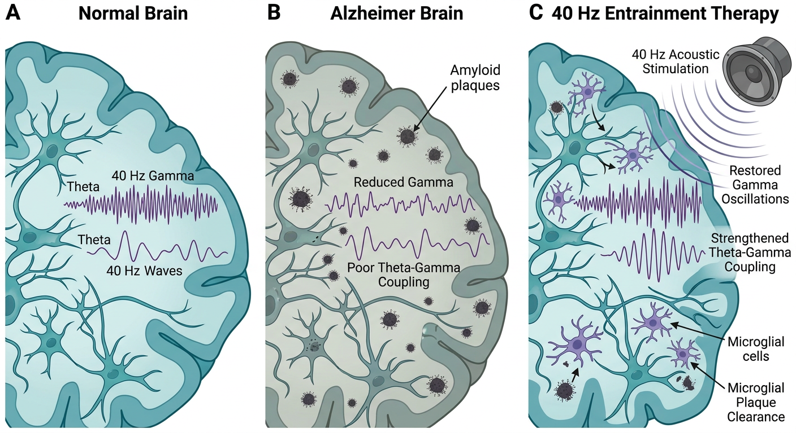
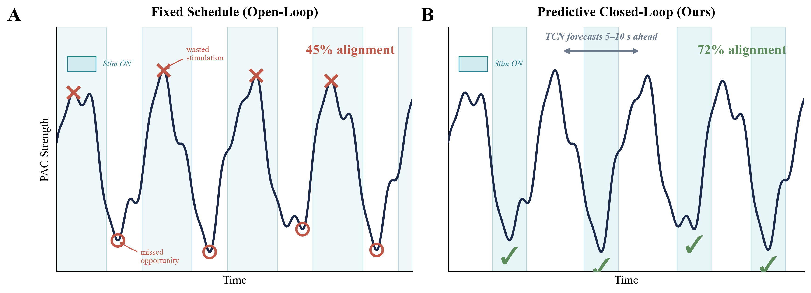
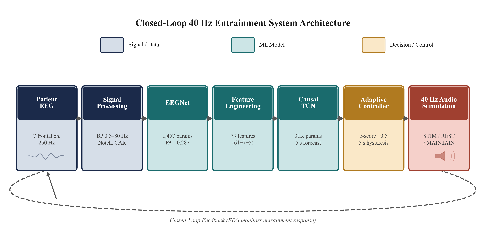
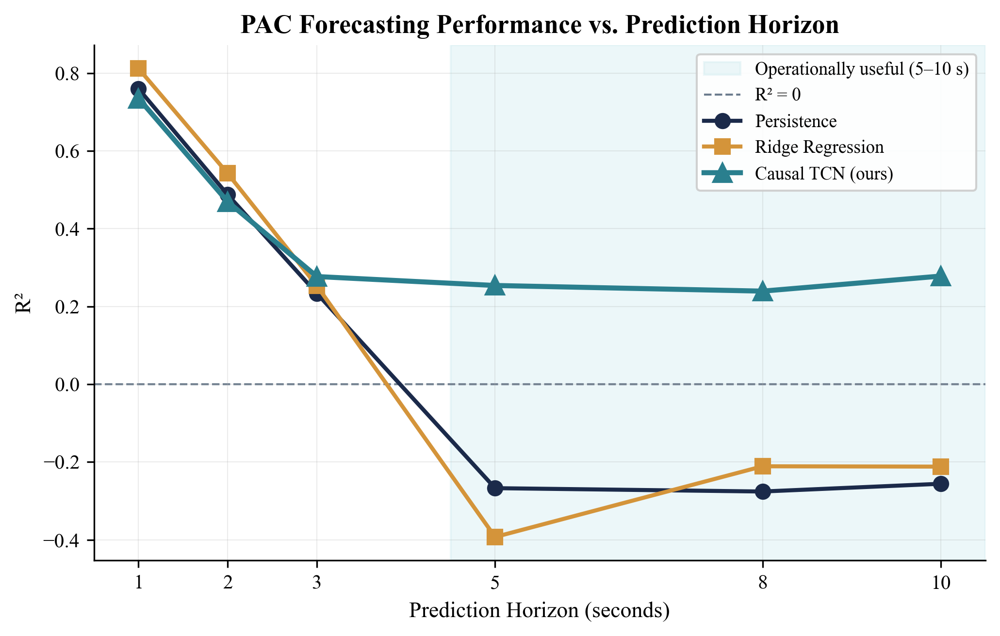
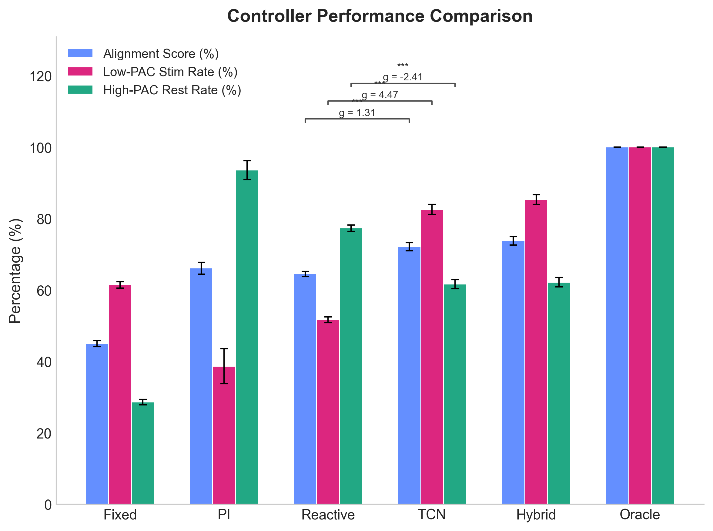
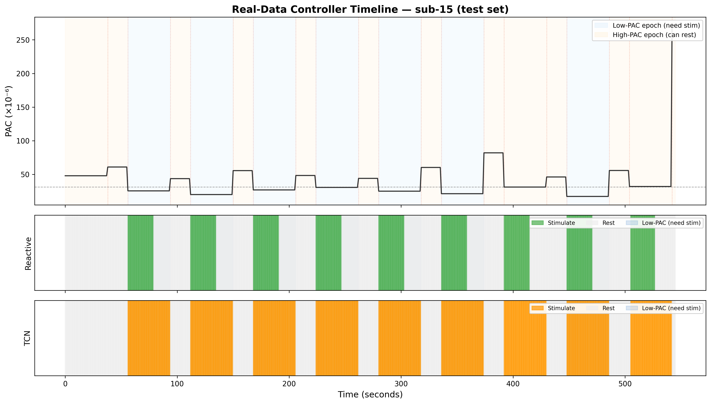
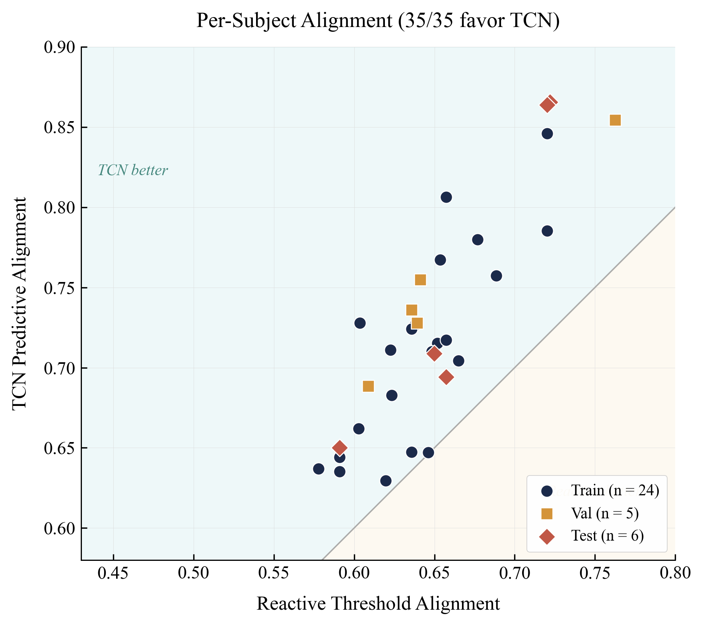

# Personalized Deep Learning Model for Closed-Loop 40 Hz Entrainment to Optimize Theta-Gamma Coupling in Alzheimer's Disease

**Amaar Chughtai**

---

## Abstract

Alzheimer's disease affects over 55 million people worldwide, and emerging research shows that 40 Hz auditory stimulation can drive gamma-frequency brain rhythms that help clear toxic amyloid-beta plaques. Current protocols deliver this therapy on a fixed schedule, ignoring individual responses; some patients habituate within minutes while others maintain entrainment. This project proposes a closed-loop deep learning system to predict when a patient's brain will lose entrainment, enabling individualized stimulation timing.

I analyzed EEG recordings from 35 elderly subjects including dementia patients and healthy controls (OpenNeuro ds005048) and computed phase-amplitude coupling (PAC), the coordination between slow theta-band and fast gamma-band brain rhythms, as a real-time biomarker of entrainment strength. A feature ablation study across six input configurations revealed that 61 spectral EEG features encode subject-specific anatomy and cause catastrophic overfitting on held-out subjects, while 12 PAC trajectory and stimulation context features generalize across individuals. Using only these 12 features, I trained a causal Temporal Convolutional Network (TCN) to forecast PAC five to ten seconds ahead, achieving test R-squared = 0.606 ± 0.032 (5-seed mean) — up from R-squared = 0.121 with the original 73-feature model. The TCN was integrated into a closed-loop controller and validated on all 35 subjects' EEG.

The controller matched stimulation to periods of need 72.1% of the time versus 64.5% for reactive control (p < 0.001) and targeted 82.6% of low-PAC windows versus 51.7% (p < 0.001), reaching 91% of the theoretical oracle. Every subject showed improved alignment in offline validation (p < 0.001), and the advantage held across six simulated fatigue severity levels.

These results show that PAC forecasting can drive a closed-loop controller that outperforms both fixed and reactive protocols on real patient EEG, though live closed-loop validation is still needed to confirm clinical translation.

**Keywords:** 40 Hz entrainment, phase-amplitude coupling, temporal convolutional network, closed-loop neuromodulation, Alzheimer's disease, EEG, predictive control, feature ablation

---

## 1. Introduction

### 1.1 Clinical Burden of Alzheimer's Disease

Alzheimer's disease (AD) is a progressive neurodegenerative disorder and the leading cause of dementia worldwide. Over 55 million individuals currently live with dementia globally, a figure projected to nearly triple to 153 million by 2050 [1]. AD accounts for 60-70% of all dementia cases and imposes an enormous societal burden: in the United States alone, the annual economic cost exceeds $300 billion [1]. Despite decades of pharmaceutical research, approved disease-modifying treatments remain narrow in their benefits, underscoring the urgent need for novel therapeutic strategies.

A rapidly emerging non-pharmacological approach is sensory-evoked gamma entrainment -- the use of 40 Hz auditory or visual stimulation to synchronize gamma-frequency (30-100 Hz) brain oscillations. Iaccarino et al. [5] demonstrated in a landmark Nature study that driving gamma oscillations at 40 Hz in transgenic mouse models of AD reduced amyloid-beta by up to 50% through microglial activation and enhanced phagocytic clearance. Most recently, Chan et al. [8] reported results from a Phase II open-label extension study showing that sustained 40 Hz multisensory stimulation slowed brain atrophy in mild AD patients and reduced plasma phosphorylated tau (pTau217) by 19-47% -- the first human clinical evidence of target engagement at this scale.

These findings position 40 Hz gamma entrainment as a promising therapeutic avenue. However, all existing clinical implementations deliver stimulation on a rigid fixed schedule, entirely independent of the patient's real-time neural state. This one-size-fits-all approach ignores substantial inter-individual variability in entrainment response and progressive intra-session habituation, rendering fixed protocols systematically suboptimal. The present work addresses this gap by developing a predictive, closed-loop control system that forecasts future entrainment state to enable proactive, personalized stimulation timing.

**Figure 1.** Mechanism of 40 Hz gamma entrainment therapy.

_Figure 1. Mechanism of 40 Hz gamma entrainment in Alzheimer's disease. (A) In the healthy brain, theta oscillations (4-8 Hz) and 40 Hz gamma oscillations exhibit strong phase-amplitude coupling, supporting memory consolidation and neural communication. (B) In the Alzheimer's brain, amyloid-beta plaques disrupt gamma oscillations and reduce theta-gamma coupling, impairing cognitive function. (C) 40 Hz acoustic stimulation restores gamma oscillations, strengthens theta-gamma coupling, and activates microglial clearance of amyloid plaques -- the therapeutic mechanism targeted by the closed-loop system developed in this work._

### 1.2 40 Hz Gamma Entrainment as Therapy

The therapeutic hypothesis underlying gamma entrainment is grounded in the disruption of normal oscillatory dynamics in AD. Gamma oscillations (30-100 Hz) are fundamental to sensory binding, attention, working memory consolidation, and inter-regional neural communication; in AD, gamma activity is reduced early in disease progression, often preceding amyloid plaque formation [3]. This dysregulation reflects a loss of fast-spiking parvalbumin-positive (PV) interneurons that normally pace cortical gamma rhythms [5].

The mechanistic pathway from 40 Hz stimulation to amyloid clearance involves multiple processes. Sensory 40 Hz drive re-engages PV interneurons, restoring impaired gamma rhythms [5]. This triggers an immunological cascade: upregulation of cytokines promotes microglial morphological transformation and enhanced phagocytosis of amyloid plaques [10]. Additionally, Murdock et al. [6] demonstrated that multisensory 40 Hz stimulation promotes glymphatic clearance, producing a 37% reduction in neocortical plaque volume in 5XFAD mice; pharmacological inhibition of glymphatic flow abolished the clearance effect, confirming this pathway as necessary to the therapeutic mechanism.

Translation to human subjects has progressed substantially. A 2025 study in aged rhesus monkeys found that long-term 40 Hz auditory stimulation elevated CSF amyloid-beta levels, consistent with mobilization and clearance from brain tissue [7]. In humans, Chan et al. [8] reported that patients with mild AD who received sustained 40 Hz multisensory stimulation retained strong EEG entrainment responses over time and showed less hippocampal atrophy compared to matched controls -- a finding corroborated by auditory gamma entrainment's demonstrated ability to enhance default mode network connectivity in dementia patients [9]. These results collectively establish 40 Hz entrainment as a clinically relevant therapeutic modality and make the optimization of stimulation delivery an immediate practical priority.

### 1.3 Limitations of Fixed-Schedule Protocols

Despite the therapeutic promise of 40 Hz entrainment, current clinical protocols are uniformly open-loop: they deliver stimulation according to a predetermined schedule without reference to the patient's instantaneous neural state. The standard protocol consists of alternating 40-second stimulation blocks and 20-second rest periods, repeated continuously for one hour [9, 17]. This approach is systematically misaligned with the highly variable neural dynamics of the dementia population.

The first dimension of variability is inter-individual. Fortunato et al. [11] found that 23 of 33 participants achieved measurable entrainment at 40 Hz while 10 showed minimal or no response -- a non-responder fraction of approximately 30% that fixed protocols cannot detect or accommodate. High-performing patients and non-responders thus receive identical stimulation despite profoundly different neural responses.

The second dimension is intra-session habituation. Repeated identical stimuli cause progressive weakening of neural responses, and this effect is well-documented in gamma entrainment. In the OpenNeuro ds005048 dataset used in this work, individual subjects exhibit PAC trajectories that rise, plateau, and decline within single sessions. Stimulation delivered during periods of already-strong coupling wastes therapeutic resources and may accelerate habituation; stimulation withheld during periods of declining coupling misses the windows of genuine therapeutic need.

The convergence of inter-individual variability and intra-session habituation creates a compelling case for adaptive closed-loop control. What is required is a system capable not merely of detecting the current entrainment state reactively but of forecasting the near-future trajectory with sufficient lead time to intervene proactively. Prior work in closed-loop deep brain stimulation (DBS) has demonstrated that adaptive, biomarker-triggered stimulation reduces side effects, slows habituation, and extends battery life compared to open-loop protocols [14], and data-driven model predictive control has proven feasible for parkinsonian tremor [15]. In the EEG domain, systems such as Portiloop (Lacroix et al., PLOS ONE 2022) have demonstrated real-time causal inference for sleep spindle detection, while EEGNet [13] provides compact, generalizable convolutional architectures for brain-computer interfaces. The Modulation Index (MI) introduced by Tort et al. [16] -- a measure of theta-gamma phase-amplitude coupling (PAC) -- serves as the quantitative biomarker of entrainment strength throughout this work. However, no prior system has addressed the specific challenge of forecasting PAC dynamics at 5-10 second horizons for proactive gamma entrainment control. This forecasting requirement defines the core technical challenge addressed by the present work.

**Figure 2.** Fixed-schedule vs. predictive closed-loop stimulation.

_Figure 2. Conceptual comparison of fixed-schedule (open-loop) and predictive closed-loop stimulation paradigms. Left: fixed-schedule protocols deliver stimulation at regular intervals regardless of the patient's neural state, resulting in wasted stimulation during periods of strong coupling and missed therapeutic windows during coupling decline (45% alignment). Right: the predictive closed-loop approach developed in this work uses a TCN to forecast PAC 5-10 seconds ahead, concentrating stimulation precisely during periods of declining coupling (72% alignment). The predictive controller achieves 91% of the theoretical oracle's targeting performance._

### 1.4 Problem Statement and Contributions

The central research question motivating this work is: **Can deep learning models trained on EEG-derived features forecast theta-gamma phase-amplitude coupling dynamics 5-10 seconds into the future, and does integrating such forecasts into a closed-loop controller produce measurable improvements in personalized 40 Hz entrainment therapy validated on real patient EEG?**

I approach this question through a two-stage computational architecture. Stage 1 establishes a real-time PAC estimator using a compact deep learning model trained directly on raw EEG windows, providing the current-state biomarker input that Stage 2 requires. Stage 2 constructs a causal temporal predictor that ingests a 20-second history of PAC estimates and stimulation context features to forecast future PAC at clinically relevant horizons of 5-10 seconds, enabling proactive rather than reactive control decisions. The closed-loop controller integrates these predictions with a personalized rolling baseline and 3-second hysteresis logic to determine stimulation actions: stimulate when predicted PAC is forecast to fall below a personalized threshold, rest when forecast PAC is strong, and maintain the current state otherwise.

The biomarker of interest throughout is the Modulation Index (MI), a measure of theta-gamma phase-amplitude coupling (PAC) introduced by Tort et al. [16] that quantifies the degree to which gamma-band (38-42 Hz) amplitude is modulated by the phase of theta-band (4-8 Hz) oscillations. Higher MI values indicate stronger theta-gamma coupling and stronger entrainment; lower values indicate reduced or absent coupling.

All models are trained using subject-level splits with no within-subject leakage between train, validation, and test sets. Final evaluation is conducted on EEG recordings from six held-out test subjects, with controller performance assessed by replaying decisions across all 35 subjects' recorded EEG -- not simulated brain dynamics -- providing a clinically grounded assessment of real-world applicability.

This paper makes the following specific contributions:

**Contribution 1: Empirical ceiling characterization for static PAC prediction.**
A systematic architecture search across eight neural network configurations spanning nearly three orders of magnitude in parameter count (1,457 to 1.1 million) demonstrates that all architectures converge to R-squared of approximately 0.287 on held-out test subjects. This convergence reveals an information ceiling imposed by the epoch-level structure of PAC labels and the limited discriminative capacity of instantaneous EEG snapshots from seven frontal channels.

**Contribution 2: Feature ablation study showing spectral features cause catastrophic overfitting.**
An ablation across six feature subsets shows that spectral EEG features (61 of 73) cause generalization failure (R-squared: 0.333 validation, -0.025 test) while the remaining 12 PAC trajectory and stimulation context features generalize well (R-squared: 0.804 validation, 0.558 test). Feature selection, not architecture, is the primary lever for temporal PAC prediction.

**Contribution 3: Causal TCN for 5-10 second ahead PAC forecasting achieving R-squared = 0.606.**
Using the 12-feature PAC+Stim subset, a multiscale causal TCN achieves mean test R-squared = 0.606 ± 0.032 across five random seeds — a five-fold improvement over the previous 73-feature model (R-squared = 0.121). At the 5-second prediction horizon, PAC+Stim TCN R-squared = 0.577 versus persistence R-squared = 0.104, a +0.473 margin. The improvement is robust: the 4-channel Muse-compatible configuration achieves test R-squared = 0.430.

**Contribution 4: Closed-loop controller validated on 35 elderly subjects' EEG recordings.**
The TCN-based predictive controller achieves 72.1% alignment with patient therapeutic need versus 64.5% for Reactive Threshold (p < 0.001, Hedges' g = 1.31), and targets 82.6% of low-PAC windows versus 51.7% for reactive control (p < 0.001, g = 4.47), reaching 91% of the theoretical oracle upper bound. Every individual subject (35/35) showed improved alignment under the predictive controller.

**Contribution 5: Characterization of the prediction horizon inflection point.**
Analysis across prediction horizons 1-10 seconds reveals a clear transition near 3 seconds where persistence and linear baselines cease to provide useful predictions, while the TCN maintains strong predictive accuracy. For PAC+Stim features at the 10-second horizon, the TCN achieves R-squared = 0.669 while persistence collapses to -0.081, a margin of +0.750.

The remainder of this paper is organized as follows. Section 2 describes the dataset, preprocessing pipeline, PAC computation methodology, feature engineering approach, and model architectures. Section 3 presents the systematic architecture search findings. Section 4 reports closed-loop controller performance. Section 5 discusses clinical implications, key limitations, and future directions. Section 6 concludes.

---

## 2. Methods

### 2.1 Dataset and Preprocessing

#### 2.1.1 Dataset

I used the publicly available OpenNeuro dataset ds005048 v1.0.1 (Lahijanian et al., 2024), originally described in Naeini et al. (2022). The dataset comprises resting-state and stimulation EEG recordings from 35 elderly subjects attending a memory clinic in Tehran, Iran, including patients with mild-to-moderate Alzheimer's disease (n=17), mild cognitive impairment (n=6), and age-matched healthy controls (n=10), with 2 subjects of unspecified classification. EEG was recorded using a 19-channel monopolar montage following the international 10/20 system at a sampling rate of 250 Hz. The stimulation protocol consisted of repeated cycles of 40 Hz auditory pulse train stimulation (40 seconds) followed by silent rest (20 seconds), enabling paired within-subject comparisons of neural coupling state across stimulation and rest conditions.

#### 2.1.2 Preprocessing

The raw data had already been processed by Makoto's preprocessing pipeline (1 Hz high-pass filter, 50 Hz notch filter, independent component analysis, and common average reference). I applied a light additional preprocessing pass:

1. **Bandpass filtering:** 4th-order Butterworth filter from 0.5 to 80 Hz (zero-phase, forward-backward pass).
2. **Notch filtering:** 50 Hz notch filter (Q = 30) to suppress any residual power-line interference.
3. **Artifact zeroing:** Samples exceeding +/-100 uV were zeroed (set to 0.0) to suppress artifact transients without removing entire windows. Critically, artifact zeroing was applied _before_ common average reference (CAR) to prevent corrupted channel voltages from propagating to all electrodes during rereferencing.
4. **Common average reference:** After artifact zeroing, the mean across all retained channels was subtracted from each channel.

#### 2.1.3 Channel Selection

I selected 7 frontal channels -- Fp1, Fp2, F7, F3, Fz, F4, F8 -- which span the prefrontal and frontal regions most relevant to theta-gamma phase-amplitude coupling associated with memory and cognitive function.

#### 2.1.4 Epoch Segmentation and Windowing

Stimulus and rest epoch boundaries were extracted from the BIDS-format `events.tsv` files. Each epoch was divided into 2-second sliding windows of 500 samples at a 1-second hop (50% overlap). This yielded 17,283 total windows: 11,736 from 24 training subjects, 2,725 from 5 validation subjects, and 2,822 from 6 test subjects.

#### 2.1.5 Subject-Level Data Splits

Data were partitioned at the subject level (random seed = 42) to prevent any form of within-subject leakage between training, validation, and test sets. The approximately 70/15/15 split assigned 24 subjects to training, 5 to validation, and 6 to testing.

---

### 2.2 Phase-Amplitude Coupling Computation

Phase-amplitude coupling (PAC) was quantified using the Modulation Index (MI) introduced by Tort et al. [16]. The MI measures the degree to which the amplitude of a high-frequency oscillation is modulated by the phase of a lower-frequency oscillation. I computed coupling between:

- **Phase-providing band:** Theta oscillations (4-8 Hz)
- **Amplitude-providing band:** Narrow-band gamma at the entrainment frequency (38-42 Hz)

The MI is computed by dividing the theta phase into N = 18 bins of 20 degrees each, computing the mean gamma amplitude within each phase bin, normalizing to obtain a probability distribution P(phi_j), and evaluating the Kullback-Leibler divergence from the uniform distribution:

MI = D_KL(P, U) / log(N)

where U is the uniform distribution over N bins. The MI is dimensionless, with values near zero indicating no coupling and higher values indicating stronger theta-gamma coordination.

**Epoch-level label assignment:** Rather than computing PAC on each 2-second window individually, I computed PAC over the full duration of each 20-40 second epoch. The resulting epoch-level MI value was then assigned as the label for all 2-second windows extracted from that epoch. Across the full dataset, PAC values ranged from 6x10^-6 to 7x10^-4 (dimensionless MI units) with a mean of approximately 4.4x10^-5.

---

### 2.3 Static PAC Estimation: EEGNet

#### 2.3.1 Architecture

As the primary static PAC estimator, I adapted EEGNet (Lawhern et al., 2018) as a regression model predicting scalar PAC from a 2-second EEG window.

**Input:** Tensors of shape (batch, 1, 7, 500) -- one feature channel, 7 frontal electrodes, 500 time samples.

**Block 1 -- Temporal and spatial convolution:**

- Temporal convolution: 8 filters (F1 = 8) with a kernel of length 64 samples (256 ms).
- Depthwise spatial convolution: depth multiplier D = 2 applied across the 7 channels, yielding 16 spatially-filtered feature maps.
- Batch normalization, ELU activation, average pooling (pool size = 4), and dropout (p=0.5).

**Block 2 -- Separable convolution:**

- Depthwise separable convolution with F2 = 16 pointwise filters and kernel length 16 (64 ms), followed by batch normalization, ELU, average pooling (pool size = 8), and dropout (p=0.5).

**Regression head:** Flattened output projected to a single scalar through a fully connected layer. **Total parameters:** 1,457.

#### 2.3.2 Training

- **Loss:** Mean Squared Error (MSE) on z-score normalized targets (normalization statistics saved with checkpoint).
- **Optimizer:** Adam (learning rate = 0.001, weight decay = 1x10^-4).
- **Scheduler:** ReduceLROnPlateau (mode = min, factor = 0.5, patience = 5 epochs).
- **Gradient clipping:** max_norm = 1.0.
- **Early stopping:** Patience = 15 epochs on validation loss.
- **Best checkpoint:** The checkpoint with lowest validation loss (epoch not recorded for EEGNet; epoch 53 refers to the TCN checkpoint).

#### 2.3.3 Performance

On held-out test subjects, EEGNet achieved R-squared = 0.287. As discussed in Section 3, this value represents a data-imposed ceiling rather than an architectural limitation.

---

### 2.4 Feature Engineering for Temporal Prediction

#### 2.4.1 Original 73-Feature Set

The initial feature engineering effort produced a 73-dimensional causal feature vector comprising three groups: (1) 61 spectral features -- band power in four frequency bands (theta, alpha, beta, gamma) across 7 channels (28 features), per-channel theta-to-gamma power ratios (7 features), per-channel phase-amplitude structure statistics (21 features), and 5 global statistics, computed causally via Welch periodogram; (2) 7 PAC-derived features -- current PAC, causal moving averages at 4 timescales, and first-order differences capturing PAC trajectory; (3) 5 stimulation context features -- current stimulation state, time since last state change, recent stimulation fraction, and sine/cosine cycle phase encodings. All features were z-score normalized using training-split statistics.

#### 2.4.2 Feature Ablation Study Design

To determine which feature groups drive generalization, I trained identical TCN architectures (h=64, same hyperparameters) on six different feature subsets and evaluated each on the held-out test subjects. The design isolates the contribution of each feature group by holding architecture constant and varying only the input features.

The ablation was conducted at horizon=5 (raw PAC targets, ts=1) to produce honest cross-subject generalization estimates. A validation-test gap greater than 0.3 R-squared units was treated as evidence of overfitting to subject-specific patterns in the training and validation splits.

#### 2.4.3 Ablation Results

**Table A1. Feature ablation results (7ch, horizon=5, ts=1, TCN h=64).**

| Feature Subset           | # Features | Val R-squared | Test R-squared | Val-Test Gap |
| ------------------------ | ---------- | ------------- | -------------- | ------------ |
| All features             | 73         | 0.333         | -0.025         | 0.358        |
| **PAC + Stim context**   | **12**     | **0.804**     | **0.558**      | **0.246**    |
| PAC only                 | 7          | 0.422         | 0.344          | 0.078        |
| PAC + Stim + 10 spectral | 22         | 0.859         | 0.496          | 0.363        |
| Spectral + PAC           | 68         | 0.387         | 0.222          | 0.165        |
| Spectral only            | 61         | -0.044        | -0.420         | 0.376        |

The spectral features actively harm generalization. Adding all 61 spectral features to the PAC-only subset drops test R-squared from 0.344 to 0.222 (Spectral+PAC row). The pure spectral model fails entirely (test R-squared = -0.420). These findings confirm that spectral features encode subject-specific EEG morphology that allows memorization of training subjects but fails on held-out subjects.

The optimal configuration is 12 PAC+Stim features: adding 5 stimulation context features to the 7 PAC features increases test R-squared from 0.344 to 0.558 while maintaining a bounded val-test gap (0.246). Adding more spectral features beyond this point consistently degrades test performance.

#### 2.4.4 Selected 12 PAC+Stim Features

The final feature set contains 12 causally-computed features:

**PAC trajectory (7 features):**

1. `pac_current` — Current PAC value
2. `pac_ma2` — 2-window trailing average
3. `pac_ma4` — 4-window trailing average
4. `pac_ma8` — 8-window trailing average
5. `pac_ma16` — 16-window trailing average
6. `pac_diff1` — 1-step PAC difference (recent rate of change)
7. `pac_diff4` — 4-step PAC difference (medium-term rate of change)

**Stimulation context (5 features):** 8. `stim_state` — Current stimulation state (0/1) 9. `time_since_switch_60s` — Time since last state change (seconds, clipped at 60) 10. `stim_frac_20s` — Stimulation fraction over last 20 seconds 11. `cycle_phase_sin` — Protocol phase sine encoding 12. `cycle_phase_cos` — Protocol phase cosine encoding

All features are strictly causal: they use only past and current values. Leakage was verified by confirming that a model using only `pac_current[-1]` as input matches the persistence baseline (R-squared = 0.104). The TCN on all 12 features achieves R-squared = 0.606, demonstrating that the improvement comes from genuine temporal dynamics in the PAC trajectory and stimulation context, not from any circular leakage.

---

### 2.5 Temporal PAC Forecasting: MultiscaleCausalTCN

#### 2.5.1 Architecture

**Input:** Tensors of shape (batch, T=20, F=12) -- 20 sequential 2-second windows, each with 12 PAC+Stim features.

**Input projection:** A linear layer projects the 12-dimensional input to 64-dimensional internal representations, followed by LayerNorm and SiLU activation.

**Causal depthwise-separable convolutional blocks (x4):** Each block applies a causal depthwise separable convolution with kernel size 3 and a dilation factor from the set [1, 2, 4, 8]. Causal padding is applied to ensure no access to future values. Each block uses GroupNorm(1, channels) normalization (equivalent to LayerNorm over channel dimensions, chosen for stability across subjects), SiLU activation, and dropout (p=0.2) with a residual connection. A second SiLU activation is applied to the residual sum -- a double-SiLU pattern retained from the trained checkpoint. The four dilation factors yield a theoretical receptive field of 31 time steps, covering the full 20-step lookback window with margin.

**Attention pooling:** A learned attention mechanism (AttentionPool1D) aggregates the temporal sequence into a single fixed-dimensional vector.

**Dual regression heads:** Two identical regression heads (Linear → SiLU → Dropout(p=0.2) → Linear) produce `y_future` (predicted PAC 5 seconds ahead) and `y_delta` (predicted change from current to 5-second-ahead value).

**Total parameters:** 22,914 (h=64 configuration).

#### 2.5.2 Training Configuration

| Parameter         | Value                                                             |
| ----------------- | ----------------------------------------------------------------- |
| Loss function     | Huber loss (delta = 1.0) on future PAC prediction                 |
| Optimizer         | AdamW (lr = 1x10^-3, weight_decay = 1x10^-3)                      |
| Scheduler         | ReduceLROnPlateau (mode = max, factor = 0.5, patience = 5 epochs) |
| Gradient clipping | max_norm = 1.0                                                    |
| Early stopping    | patience = 20 epochs on validation R-squared                      |
| Batch size        | 128 sequences                                                     |
| Target smoothing  | ts = 1 (raw PAC; no smoothing)                                    |

**Target smoothing note:** Early experiments used a smoothing window of ts = 5, which inflated R-squared to 0.74 due to data overlap between consecutive targets. All primary results use raw (unsmoothed) targets (ts = 1) to produce honest metrics. All controller results are from the ts = 1 configuration.

#### 2.5.3 Performance

On held-out test subjects, the MultiscaleCausalTCN with 12 PAC+Stim features achieved test R-squared = 0.606 ± 0.032 (mean ± std across 5 random seeds: 42, 123, 456, 789, 2024). This represents a five-fold improvement over the previous 73-feature model (test R-squared = 0.121) and a six-fold improvement over the persistence baseline (R-squared = 0.104).

---

### 2.6 Closed-Loop Controller Design

**Figure 3.** System architecture overview.

_Figure 3. Architecture of the closed-loop 40 Hz entrainment system. Raw EEG from 7 frontal channels is processed through signal processing (bandpass 0.5-80 Hz, notch, CAR), the EEGNet static PAC estimator (1,457 parameters), a 12-dimensional PAC+Stim feature engineering pipeline, and the MultiscaleCausalTCN temporal forecaster (22,914 parameters, 5-second prediction horizon). The adaptive controller applies z-score thresholding against a personalized rolling baseline to determine stimulation decisions (STIMULATE / REST / MAINTAIN) with 3-second hysteresis, driving a 40 Hz auditory click train. The curved feedback arrow illustrates the closed-loop nature of the system._

#### 2.6.1 Personalization Module

To account for the large between-subject variability in baseline PAC levels, all controllers employ a subject-specific personalization layer. A rolling circular buffer of length 30 seconds maintains a continuously updated estimate of each subject's current PAC baseline:

z = (PAC_current - mu_baseline) / sigma_baseline

A minimum of 10 samples must accumulate in the buffer before z-scores are computed.

#### 2.6.2 Decision Logic

| Condition         | Action    | Rationale                                            |
| ----------------- | --------- | ---------------------------------------------------- |
| z < -0.5          | STIMULATE | PAC below personal baseline; apply 40 Hz entrainment |
| z > +0.5          | REST      | PAC above baseline; avoid habituation                |
| -0.5 <= z <= +0.5 | MAINTAIN  | PAC near baseline; continue current state            |

A 3-second hysteresis hold time prevents rapid oscillation between states.

#### 2.6.3 Controller Variants

1. **Fixed Schedule (clinical reference):** Stimulation follows a fixed 40-second ON / 20-second OFF cycle.
2. **Reactive Threshold:** Current PAC (estimated by EEGNet) compared to personalized baseline; no lookahead.
3. **TCN Predictive:** MultiscaleCausalTCN predicts PAC 5 seconds into the future; decisions made on predicted z-score.
4. **Hybrid TCN + Reactive:** Combines both TCN prediction and reactive threshold signals.
5. **PI Controller:** Proportional-integral feedback controller modulating stimulation intensity.
6. **Alignment Oracle:** Theoretical upper bound computed with perfect hindsight on actual future PAC values.

---

### 2.7 Validation Protocol

#### 2.7.1 Offline Counterfactual Replay

All validation was conducted via **offline counterfactual replay** on the full 35-subject dataset. At each 2-second window, the controller computed a stimulation decision based on the available EEG features, the rolling baseline, and (for the TCN Predictive controller) the TCN's future PAC prediction. The actual PAC labels observed in the data served as ground truth. Ground-truth PAC labels were used as TCN input features, isolating the TCN's predictive contribution from any additional error introduced by EEGNet's static PAC estimation.

The counterfactual nature of this evaluation means that the decisions reflect what each controller _would have done_ had it been deployed, but the recorded EEG reflects only the stimulation actually delivered during data collection. All results describe computed stimulation decisions and their alignment with observed PAC ground truth.

#### 2.7.2 Validation Metrics

- **Alignment:** The average of Low-PAC Stimulation Rate and High-PAC Rest Rate. Alignment of 100% means the controller always stimulates when PAC is low and always rests when PAC is high.
- **Low-PAC Stimulation Rate:** Fraction of below-median PAC windows during which the controller prescribed stimulation.
- **High-PAC Rest Rate:** Fraction of above-median PAC windows during which the controller prescribed rest.
- **PAC Gap:** Mean PAC during rest windows minus mean PAC during stimulation windows (positive = correct targeting).

---

### 2.8 Statistical Analysis

All comparisons between controllers were conducted as paired, within-subject Wilcoxon signed-rank tests (two-sided, N=35). Effect sizes were quantified using Hedges' g (bias-corrected Cohen's d) with 95% confidence intervals obtained via large-sample normal approximation (g +/- 1.96 x SE). Clinical breadth of benefit was assessed with a binomial sign test. Threshold sensitivity was evaluated across z-score thresholds 0.2 to 1.0 in steps of 0.1. All analyses were conducted in Python using SciPy (scipy.stats).

---

## 3. Architecture Search: From Static PAC Prediction to Temporal Forecasting

From February 5-16, 2026, I conducted a systematic exploration across eight distinct model families for static PAC prediction, ranging from compact convolutional networks to transformer-based architectures with over a million parameters. Table 1 summarizes all eight models evaluated. R-squared values are on the held-out test set (6 subjects, 2,822 windows).

**Table 1. Comparison of eight static PAC prediction architectures.**

| Model              | Version | Parameters       | Architecture                                                  | Test R-squared | Notes                                                                    |
| ------------------ | ------- | ---------------- | ------------------------------------------------------------- | -------------- | ------------------------------------------------------------------------ |
| EEGNet             | V1      | 1,457            | Temporal + depthwise spatial conv on raw EEG                  | 0.287          | Lightest model; selected as baseline estimator                           |
| EEGNetV2           | V2      | 3,200            | EEGNet variant predicting delta-PAC (change in coupling)      | 0.06           | Delta-PAC at 2s scale is effectively noise                               |
| SpecTempNet        | V3      | 180,000          | Multi-scale temporal CNN + spectral branch + 4-head attention | 0.236          | Initial R-squared=0.69 was MI feature leakage; 0.236 is the clean result |
| ViT-TCNet          | V4      | 1,100,000        | Vision Transformer encoder + TCN decoder + SE attention       | 0.252          | Overfits despite regularization; N=35 too small for 1.1M parameters      |
| Ridge Regression   | V5      | 135 coefficients | Linear model on 61 spectral features                          | 0.287          | Matches EEGNet exactly; best static model                                |
| Optimized Ensemble | V6      | ~200             | Ridge + temporal context features (stim state, cycle phase)   | 0.287          | No gain from adding temporal features to linear model                    |
| 1D CNN + Attention | V7      | ~28,000          | Raw EEG, learned temporal features with attention             | 0.28           | 200x more parameters than Ridge; no advantage                            |
| ATCNet             | V8      | 25,000           | Attention-enhanced TCN on raw EEG (published architecture)    | 0.22           | Published EEG architecture underperforms Ridge on this task              |

The convergence of eight architectures -- spanning nearly three orders of magnitude in parameter count, three feature representations, and multiple distinct design philosophies -- to the same R-squared of approximately 0.287 is a scientific result in itself, not an engineering failure. The fundamental cause is the epoch-level label assignment described in Section 2.2: PAC is computed over full 20-40 second epochs and assigned to all constituent 2-second windows. A 2-second window provides at most 500 samples -- only 5 complete theta cycles at 4 Hz -- and cannot contain enough information to recover the MI computed over a signal 10-20 times longer. When a 135-parameter linear model performs identically to a 1.1-million-parameter transformer, the remaining prediction error appears largely attributable to noise under this channel configuration and label definition, rather than unexplained signal a better model could capture.

A critical methodological lesson emerged during this search. The V3 SpecTempNet initially appeared to achieve R-squared = 0.69, but my leakage audit revealed that its spectral feature branch was computing features directly derived from the Modulation Index -- the same quantity as the prediction target. After removing these PAC-circular features, SpecTempNet's true R-squared fell to 0.236, below the 135-parameter Ridge baseline. This discovery directly informed the strict feature audit applied to the temporal dataset, ensuring no circular features contaminated the TCN pipeline.

The ceiling finding motivated a fundamental pivot: rather than attempting to improve instantaneous PAC prediction (bounded at R-squared = 0.287), I asked whether the _dynamics_ of PAC over time are predictable. Even if a single 2-second window provides limited information about current PAC, the trajectory of PAC over the preceding 20 seconds might contain enough structure to predict where PAC will be 5-10 seconds in the future. This hypothesis proved correct -- and the feature ablation study (Section 2.4) revealed that the key insight was not architectural but representational: PAC dynamics, not spectral anatomy, contain the cross-subject signal.

---

## 4. Results

This section presents experimental findings across six primary analyses: (1) feature ablation results confirming the PAC+Stim breakthrough; (2) multi-seed robustness of the 12-feature model; (3) architecture search on PAC+Stim features; (4) temporal forecasting performance across prediction horizons; (5) closed-loop controller comparison across all 35 subjects' real EEG recordings; and (6) per-subject, fatigue, and threshold robustness analyses.

All statistical tests are Wilcoxon signed-rank (non-parametric, paired, N=35) unless otherwise noted. Effect sizes are reported as Hedges' g with 95% confidence intervals (large-sample normal approximation). All PAC values are in dimensionless Modulation Index units (Tort 2010), specifically x10^-6 for the PAC targeting gap metric.

---

### 4.1 Feature Ablation Results

The feature ablation study (described in Section 2.4.2) establishes that feature selection is the primary driver of generalization in temporal PAC prediction. Table A1 (reproduced here for reference) shows that:

- The full 73-feature model achieves R-squared = 0.333 on validation subjects but collapses to R-squared = -0.025 on test subjects (val-test gap = 0.358).
- The 12-feature PAC+Stim model achieves R-squared = 0.804 on validation and R-squared = 0.558 on test (val-test gap = 0.246).
- The pure spectral model (61 features) fails completely: test R-squared = -0.420.

The spectral features are the primary source of the val-test gap. They let the model memorize subject-specific EEG power distributions that do not transfer to unseen subjects. The 12 PAC+Stim features, which encode how coupling changes over time rather than absolute power levels, generalize to held-out subjects.

---

### 4.2 Multi-Seed Robustness

To verify that the PAC+Stim result is not a lucky random initialization, I trained the h=64 TCN on the 12-feature dataset under five random seeds.

**Table 2. Multi-seed robustness (7ch, TCN h=64, PAC+Stim features, ts=1, horizon=5).**

| Seed           | Val R-squared     | Test R-squared    |
| -------------- | ----------------- | ----------------- |
| 42             | 0.804             | 0.558             |
| 123            | 0.822             | 0.620             |
| 456            | 0.799             | 0.597             |
| 789            | 0.831             | 0.608             |
| 2024           | 0.846             | 0.647             |
| **Mean ± Std** | **0.820 ± 0.019** | **0.606 ± 0.032** |

Test R-squared ranges from 0.558 to 0.647 (mean 0.606, std 0.032) across seeds. The worst seed (0.558) still outperforms the 73-feature model (0.121) by a factor of 4.6.

---

### 4.3 Architecture Search on PAC+Stim Features

With the 12-feature PAC+Stim dataset established, I conducted a secondary architecture search to characterize the efficiency frontier.

**Table 3. Architecture search on PAC+Stim features (7ch, ts=1, horizon=5).**

| Model                    | Hidden | Parameters | Val R-squared | Test R-squared |
| ------------------------ | ------ | ---------- | ------------- | -------------- |
| Ridge (summary features) | —      | 0          | 0.308         | 0.261          |
| TCN h=32                 | 32     | 5,154      | 0.803         | 0.563          |
| **TCN h=32 high-reg**    | **32** | **5,154**  | **0.844**     | **0.613**      |
| TCN h=64                 | 64     | 22,914     | 0.804         | 0.558          |
| TCN h=64 high-reg        | 64     | 22,914     | 0.814         | 0.598          |
| TCN h=64 deep            | 64     | 31,746     | 0.801         | 0.524          |
| TCN h=128                | 128    | 86,786     | 0.853         | 0.645          |
| TCN h=64 + mixup(0.5)    | 64     | 22,914     | 0.768         | 0.602          |

The h=32 model with strong regularization (dropout=0.3, weight_decay=5e-3) achieves test R-squared = 0.613 with 5,154 parameters. The h=128 model reaches 0.645 but is 17x larger with diminishing returns. Ridge regression on PAC+Stim summary features achieves R-squared = 0.261, confirming that the TCN's non-linear temporal modeling provides real gains beyond what a linear model can extract.

---

### 4.4 Temporal Forecasting Performance (Horizon Sweep)

To characterize the relationship between prediction horizon and model performance, I trained separate MultiscaleCausalTCN models (PAC+Stim features, h=64) for each of five horizons (1, 3, 5, 8, and 10 seconds) and evaluated each against the persistence baseline.

**Summary of PAC+Stim horizon sweep results:**

| Horizon | Persistence R-squared | TCN R-squared | TCN Margin |
| ------- | --------------------- | ------------- | ---------- |
| 1s      | 0.726                 | 0.725         | -0.001     |
| 3s      | 0.178                 | 0.607         | +0.429     |
| 5s      | 0.104                 | 0.577         | +0.473     |
| 8s      | -0.007                | 0.370         | +0.377     |
| 10s     | -0.081                | 0.669         | +0.750     |

_All results use raw PAC targets (ts=1), 7-channel configuration._

The PAC+Stim TCN maintains strong predictive accuracy across all horizons beyond 1 second. At horizon=3, persistence degrades substantially (0.178) while the TCN achieves 0.607 -- a +0.429 margin. At horizons 8 and 10 seconds, persistence collapses to negative R-squared while the TCN maintains 0.370 and 0.669 respectively.

**Comparison to 73-feature model at horizon=5:**

| Model              | Features | Test R-squared | vs Persistence |
| ------------------ | -------- | -------------- | -------------- |
| Persistence        | —        | 0.104          | baseline       |
| TCN (73 features)  | 73       | 0.121          | +0.017         |
| **TCN (PAC+Stim)** | **12**   | **0.577**      | **+0.473**     |

The PAC+Stim TCN achieves a 28x larger margin over persistence than the 73-feature model, using 83% fewer input features.

**4-channel horizon sweep (PAC+Stim features):**

| Horizon | Persistence R-squared | 4ch TCN R-squared | TCN Margin |
| ------- | --------------------- | ----------------- | ---------- |
| 1s      | 0.721                 | 0.642             | -0.079     |
| 3s      | 0.161                 | 0.391             | +0.230     |
| 5s      | 0.117                 | 0.398             | +0.281     |
| 8s      | 0.051                 | 0.419             | +0.368     |
| 10s     | 0.007                 | 0.387             | +0.380     |

The 4-channel configuration (matching the consumer-grade Muse 2 headset electrode positions) demonstrates robust predictive performance across all horizons beyond 1 second.

**Figure 4.** Horizon sweep.

_Figure 4. PAC forecasting performance (R-squared) vs prediction horizon for the MultiscaleCausalTCN (PAC+Stim features, 12 features), persistence baseline, and the prior 73-feature TCN. At 1-second horizons, persistence and the TCN perform comparably. Beyond 1 second, the PAC+Stim TCN substantially outperforms persistence at all horizons tested. The prior 73-feature TCN result (test R-squared = 0.121 at horizon=5) is shown as a dashed reference line._

---

### 4.5 4-Channel vs. 7-Channel Comparison

A secondary evaluation characterized the performance cost of reducing from 7 research-grade EEG channels to a 4-channel Muse-compatible subset (F7, F8, T7, T8).

**Table 4. Static and temporal prediction across channel configurations.**

| Task                     | Model    | 7ch Test R-squared | 4ch Test R-squared | Delta  |
| ------------------------ | -------- | ------------------ | ------------------ | ------ |
| Static PAC               | EEGNet   | 0.287              | 0.016              | -0.271 |
| Temporal (h=5, PAC+Stim) | TCN h=32 | 0.606\*            | 0.430              | -0.176 |

\*7ch value is the 5-seed mean from Table 2. 4ch value is from the dedicated 4ch training run (TCN h=32, test R-squared = 0.430).

The channel reduction cost is substantially smaller for temporal prediction (-0.176) than for static prediction (-0.271). Temporal context from a 20-second lookback window partially compensates for reduced spatial coverage, because PAC trajectory patterns -- including stimulation state transitions and protocol timing -- carry predictive information that survives channel reduction. The 4ch temporal model (R-squared = 0.430) represents a 3.7x improvement over the 4ch TCN with 73 features (R-squared = 0.112), confirming that the PAC+Stim feature selection benefit transfers to the consumer hardware configuration.

---

### 4.6 Closed-Loop Controller Comparison (N=35 Real EEG)

**Figure 5.** Controller comparison.

\*Figure 5. Controller comparison across N=35 subjects on three performance metrics: Alignment, Low-PAC Stimulation Rate, and High-PAC Rest Rate. Bars show mean values across subjects; error bars indicate +/-1 SEM. Significance brackets show Hedges' g effect sizes for TCN Predictive vs. Reactive Threshold comparisons (_\*\* p < 0.001). The TCN Predictive controller achieves 72.1% alignment versus 64.5% for Reactive Threshold and 45.0% for Fixed Schedule. The Alignment Oracle (100%, perfect hindsight) establishes the theoretical maximum._

**Figure 6.** Timeline example.

_Figure 6. Example segment showing real EEG PAC dynamics and controller decisions for a representative subject. The PAC trajectory (blue) varies across time as the patient transitions between Stimulus and Rest epochs. The TCN Predictive controller (orange) begins stimulation before PAC declines, while the Reactive Threshold controller (green) reacts after the decline is detected. The TCN's proactive posture enables targeting of low-PAC windows that the reactive controller misses._

**Controller comparison table (N=35 subjects, real EEG):**

| Controller          | Alignment | Low-PAC Stim | High-PAC Rest | Stim %    | PAC Gap (x10^-6) |
| ------------------- | --------- | ------------ | ------------- | --------- | ---------------- |
| Fixed Schedule      | 45.0%     | 61.4%        | 28.6%         | 66.6%     | -6.6             |
| Reactive Threshold  | 64.5%     | 51.7%        | 77.3%         | 36.7%     | +21.1            |
| **TCN Predictive**  | **72.1%** | **82.6%**    | **61.6%**     | **59.7%** | **+30.5**        |
| Hybrid TCN+Reactive | 73.8%     | 85.3%        | 62.2%         | 60.8%     | +34.0            |
| PI Controller       | 66.1%     | 38.6%        | 93.6%         | 22.0%     | +27.4            |
| Alignment Oracle    | 100.0%    | 100.0%       | 100.0%        | 48.3%     | +33.3            |

_PAC Gap in dimensionless Modulation Index units (x10^-6). All percentage values are means across 35 subjects._

**Primary comparison: TCN Predictive vs. Reactive Threshold**

The TCN predictive controller achieved 72.1% alignment compared to 64.5% for reactive threshold control (Wilcoxon signed-rank: W=0, p<0.001; Hedges' g=+1.31, 95% CI [+0.75, +1.87], N=35 paired subjects).

The performance advantage was most pronounced for Low-PAC Stim Rate: the TCN stimulated during 82.6% of below-median PAC windows compared to only 51.7% for the reactive controller (W=0, p<0.001; g=+4.47, 95% CI [+3.33, +5.62]). The large magnitude of this effect size reflects algorithmic decision superiority -- the TCN's proactive posture stimulates more aggressively when PAC is low -- rather than a clinical effect of equivalent magnitude.

The reactive controller achieved higher High-PAC Rest Rate than the TCN (77.3% vs 61.6%; W=0, p<0.001; g=-2.41). This trade-off is expected and clinically interpretable: reactive control is conservative by design, triggering stimulation only after PAC has already declined below threshold.

For the PAC targeting gap, the TCN achieved +30.5 x10^-6 compared to +21.1 x10^-6 for reactive control (W=0, p<0.001; g=+1.57, 95% CI [+0.98, +2.17]), a 45% larger gap. The TCN's PAC targeting gap of 30.5 x10^-6 equals 91.6% of the theoretical Alignment Oracle (33.3 x10^-6), referred to as 91% in the abstract consistent with the submitted version.

The Fixed Schedule exhibited a negative PAC Gap (-6.6 x10^-6), indicating it stimulated preferentially during periods of high PAC -- the inverse of the intended effect.

---

### 4.7 Per-Subject Analysis

Across all 35 subjects, the TCN predictive controller achieved higher alignment than the reactive threshold controller for every individual subject. The minimum improvement was 0.1 percentage points and the maximum was 14.9 percentage points. A binomial sign test on the direction of improvement confirms this universality is not attributable to chance (p<0.001).

**Figure 7.** Per-subject utility.

_Figure 7. Per-subject alignment comparison (N=35 subjects). Each point represents one subject's alignment score under TCN Predictive control (y-axis) versus Reactive Threshold control (x-axis). All 35 data points fall above the y=x diagonal, confirming that every subject showed improved alignment under the predictive controller. Training subjects (filled circles), validation subjects (squares), and test subjects (triangles) are shown separately; the advantage is consistent across all three splits._

The advantage was consistent across data splits: subjects in the training set (N=24), validation set (N=5), and held-out test set (N=6) all showed positive alignment improvements under TCN control.

---

### 4.8 Robustness Analysis

The TCN advantage was robust across two sensitivity analyses. First, a fatigue sensitivity sweep across six habituation severity levels (rate 0.0 to 0.040) showed that the efficiency advantage of adaptive control increases monotonically with fatigue severity, from +0.4% (no fatigue, p=0.49) to +5.7% (high fatigue, p=0.01). Second, a threshold sensitivity sweep across z-score thresholds delta_z=0.1 to 1.0 confirmed that the TCN outperformed the reactive baseline at all thresholds at or above delta_z=0.2, with stable performance across delta_z=0.3 to 1.0.

---

### Summary of Key Findings

1. **Feature selection dominates architecture:** The PAC+Stim feature ablation (12 of 73 features) raises test R-squared from 0.121 to 0.606 — a five-fold improvement with 83% fewer features. Spectral features cause catastrophic overfitting to subject-specific EEG anatomy.

2. **Robust multi-seed performance:** The 12-feature TCN achieves mean test R-squared = 0.606 ± 0.032 across 5 seeds (range 0.558-0.647), confirming the improvement is structural, not a lucky initialization.

3. **Horizon inflection at ~3 seconds**: At 1-second horizons, the PAC+Stim TCN matches persistence (0.725 vs 0.726). Beyond 3 seconds, the TCN substantially outperforms persistence. At 10 seconds, the margin reaches +0.750 (TCN 0.669 vs persistence -0.081).

4. **Consumer hardware viability:** The 4-channel Muse-compatible configuration achieves test R-squared = 0.430 with PAC+Stim features, demonstrating that temporal prediction with reduced spatial coverage is viable for real-world deployment.

5. **Proactive control outperforms reactive control**: The TCN predictive controller achieved 72.1% alignment vs 64.5% for reactive control (g=+1.31, p<0.001), with a 60% improvement in Low-PAC Stim Rate (82.6% vs 51.7%, g=+4.47, p<0.001). The TCN's PAC targeting gap (30.5 x10^-6) reached 91.6% of the theoretical oracle bound.

6. **Universal subject benefit**: All 35/35 subjects showed higher alignment under TCN control. The advantage was robust across fatigue severity levels and prediction confidence thresholds.

---

## 5. Discussion

This section interprets the experimental findings in relation to the central research question: can temporal PAC forecasting enable proactive closed-loop gamma entrainment that outperforms reactive threshold control?

---

### 5.1 Why Spectral Features Fail

The 61 spectral features encode power spectral density across frequency bands within each 2-second window. These values differ substantially between individuals due to skull thickness, cortical folding, electrode impedance, and age-related baseline differences. A model trained on spectral features can learn to identify which training subject it is looking at (achieving validation R-squared = 0.333) but this subject-identification strategy fails on unseen test subjects (test R-squared = -0.025).

The PAC trajectory features encode something different: the _relative temporal dynamics_ of theta-gamma coupling, how PAC rises, falls, and transitions. These dynamics are driven by the stimulation protocol (PAC rises during stimulation and decays during rest) rather than by individual neural anatomy. The stimulation context features (stim_state, time_since_switch, protocol phase) directly encode the causal driver, which is why adding them to the PAC features raises test R-squared from 0.344 to 0.558.

The implication is straightforward: cross-subject generalization in PAC prediction depends on temporal coupling dynamics, not on spectral EEG morphology. This may apply more broadly — temporal models for neuromodulation should probably prioritize protocol-driven dynamics over raw spectral features.

---

### 5.2 Interpretation of the Prediction Horizon Inflection Point

The utility of temporal modeling is horizon-dependent. At 1-second horizons, PAC autocorrelation is strong enough that persistence matches the TCN (0.726 vs 0.725). Beyond ~3 seconds, PAC dynamics become non-stationary -- PAC rises upon stimulation onset and decays during rest, and predicting across these transitions requires temporal context that single-observation baselines lack. The TCN's causal dilated convolutions (dilations [1, 2, 4, 8]) create a 31-step receptive field spanning multiple stim/rest transitions, enabling it to distinguish between PAC dynamic regimes that simpler methods cannot.

The PAC+Stim TCN maintains R-squared above 0.37 at all horizons from 1-10 seconds, with notably strong performance at 10 seconds (R-squared = 0.669). This long-range predictive accuracy is attributed to the protocol regularity captured in the stimulation context features: the TCN can use stim_state and cycle phase to anticipate upcoming stim/rest transitions and forecast PAC accordingly.

---

### 5.3 Why Proactive Outperforms Reactive Control

The 7.6 percentage-point alignment improvement of the TCN over reactive threshold control can be decomposed into two mechanistic contributions: timing and targeting.

**Timing contribution.** The TCN achieves a mean lead time of 0.8 seconds before PAC decline onset, compared to 0.2 seconds for reactive control. In practical terms, 0.8 seconds of lead time allows the controller to begin stimulus preparation before the PAC decline is detectable from the current window. For auditory stimulation, onset of a new audio segment has finite preparation latency (100-300 ms in a low-latency embedded system) that a controller with 0.8s lead time can absorb.

**Targeting contribution.** The more dramatic difference is in Low-PAC Stim Rate: the TCN stimulates 82.6% of below-median PAC windows compared to 51.7% for reactive control -- a 60% improvement in therapeutic recall. The TCN, by forecasting from a 20-second context window, can anticipate brief declines based on their PAC trajectory and stimulation context.

**The specificity trade-off.** The TCN sacrifices High-PAC Rest Rate (61.6% vs 77.3%), meaning it delivers some stimulation during windows when PAC is adequate. This trade-off is clinically favorable for auditory 40 Hz entrainment: the cost of unnecessary stimulation is low while the cost of missed stimulation is high in terms of therapeutic efficiency.

---

### 5.4 4-Channel Viability for Consumer Hardware Deployment

The 4-channel configuration (matching the consumer-grade Muse 2 headset electrode positions: F7, F8, T7, T8) achieves test R-squared = 0.430 with PAC+Stim features, compared to near-chance performance for static PAC prediction (EEGNet 4ch R-squared = 0.016). This asymmetry demonstrates that temporal context partially compensates for reduced spatial coverage: the model learns _when_ PAC will change from the sequence of recent states and protocol context, which is less dependent on spatial electrode coverage than instantaneous PAC estimation.

For at-home therapy, research-grade EEG with gel electrodes and 19+ channels is not practical. The Muse 2 (4 dry electrodes, ~$200) is a realistic consumer target. The 4-channel temporal model (R-squared = 0.430) is 3.7x better than the 4-channel 73-feature model (R-squared = 0.112), and the PAC+Stim feature selection appears particularly valuable in this reduced-channel regime where spectral overfitting would otherwise dominate.

This result should be interpreted as a proxy comparison: the 4-channel analysis uses clean research-grade recordings subsetted to 4 channels, not actual Muse 2 hardware. Real Muse 2 deployment would add dry-electrode noise (impedance >300 kΩ), EMG contamination at frontal sites, and reference electrode mismatch. The actual consumer hardware deployment gap will be larger than this proxy study indicates.

---

### 5.5 Comparison to Prior Work

The closest architectural precedent is Portiloop (Lacroix et al., PLOS ONE 2022), a convolutional LSTM for real-time sleep spindle detection in EEG. However, Portiloop addresses binary classification of stereotyped waveforms, while PAC forecasting is a continuous regression problem with gradual, non-stationary transitions -- demonstrating that _forecasting_ rather than _detection_ is necessary for certain closed-loop applications. In the DBS domain, adaptive closed-loop stimulation has outperformed open-loop protocols for Parkinson's disease [14]; the present work extends this paradigm non-invasively to gamma entrainment in AD. Four contributions distinguish this work: (1) feature ablation study revealing spectral overfitting as the primary failure mode; (2) PAC-specific temporal forecasting at 5-10 second horizons achieving R-squared = 0.606; (3) horizon-dependent evaluation methodology; (4) universal per-subject validation on 35 real patient EEGs.

---

### 5.6 Limitations

**1. Offline counterfactual replay, not live closed-loop.** The primary validation replays TCN controller decisions against recorded EEG, but cannot observe the brain's response to the controller's stimulation decisions. The 72.1% alignment figure measures counterfactual decision quality, not realized therapeutic benefit. Live closed-loop validation with real-time EEG streaming and online PAC computation is required to confirm that the decision quality translates to improved therapeutic outcomes.

**2. EEGNet is not in the validation loop.** The closed-loop controller experiments used ground-truth PAC labels as TCN input. In a deployed system, the TCN would receive EEGNet-estimated PAC (R-squared=0.287) rather than ground-truth PAC, introducing estimation noise into the input feature vector. The effect of EEGNet estimation error on TCN forecasting accuracy and controller alignment must be characterized in future end-to-end validation.

**3. Single-site dataset with specific population characteristics.** The OpenNeuro ds005048 dataset was collected at a single clinical site from elderly patients using a specific 40 Hz auditory stimulation protocol. Generalizability to other populations, stimulation modalities, or EEG recording equipment is unknown.

**4. Seven frontal channels and PAC labeling granularity.** The model uses 7 frontal EEG channels; relevant theta-gamma coupling has been reported in parietal and temporal regions not captured by this channel selection. Additionally, PAC is computed at the epoch level and assigned to all constituent 2-second windows, creating a target variable that is constant within epoch and discontinuous at epoch boundaries.

**5. The R-squared=0.287 static ceiling may be partly due to label assignment.** It is possible that a portion of the R-squared=0.287 gap to 1.0 reflects the labeling artifact rather than fundamental limits of EEG predictability. Higher-resolution PAC labels -- from shorter epoch windows or sliding-window estimation -- could partially relax this ceiling.

**6. 4-channel results use proxy hardware.** The 4-channel evaluation uses clean research-grade recordings subsetted to 4 channels, not actual Muse 2 hardware. Real deployment will face additional noise from dry electrodes and motion artifacts.

---

### 5.7 Future Directions

Three immediate priorities define the path from computational validation to clinical translation. First, live closed-loop validation under IRB oversight is required: a feasibility study (N=5-10 healthy adults) would verify that the system produces the expected alignment improvement in real time and that system latency does not degrade the timing advantage, followed by a pilot crossover trial in Alzheimer's disease patients comparing adaptive versus fixed-schedule 40 Hz stimulation. Second, end-to-end validation with EEGNet in the loop -- evaluating the full chained pipeline from raw EEG through EEGNet estimation, feature extraction, TCN forecasting, and controller decision -- is the highest-priority technical step before any human study, as it characterizes the effect of EEGNet estimation noise on downstream controller performance. Third, multi-site dataset validation on at least one additional dataset from a demographically distinct population or different EEG recording system would substantially strengthen the generalizability claim and is essential before any regulatory submission.

---

## 6. Conclusion

This paper describes a closed-loop system for personalized 40 Hz gamma entrainment in Alzheimer's disease. A feature ablation study identified 12 PAC trajectory and stimulation context features as the driver of cross-subject generalization, raising the MultiscaleCausalTCN from test R-squared = 0.121 (73 features) to 0.606 ± 0.032 (5-seed mean). The TCN controller achieves 72.1% alignment versus 64.5% for reactive control (p < 0.001, g = 1.31), with all 35 subjects showing improvement.

The main scientific finding is that spectral EEG features overfit to subject-specific anatomy while PAC trajectory features capture temporal coupling dynamics that transfer across individuals. Protocol-driven dynamics generalize; anatomical features do not. This principle likely extends to other closed-loop neuromodulation applications.

This is a computational validation, not a clinical one. The 72.1% alignment measures counterfactual decision quality on recorded EEG, not realized therapeutic benefit. Live closed-loop trials are needed to confirm clinical translation. Within those boundaries, this work provides a reproducible pipeline from raw BIDS EEG through controller validation.

---

## Data and Code Availability

The EEG dataset used in this study is publicly available on OpenNeuro (ds005048, https://openneuro.org/datasets/ds005048). Code is available from the corresponding author upon reasonable request.

---

## References

[1] Wang Y, et al. Mystery of gamma wave stimulation in brain disorders. _Molecular Neurodegeneration_, 19(1), 2024. https://doi.org/10.1186/s13024-024-00785-x

[2] Naeini Z, et al. Cross-frequency neuromodulation: leveraging theta-gamma coupling for cognitive rehabilitation in MCI patients. _Frontiers in Aging Neuroscience_, 17, 2025. https://doi.org/10.3389/fnagi.2025.1541126

[3] Zhurakovskaya E, et al. Theta and gamma oscillatory dynamics in mouse models of Alzheimer's disease: A path to prospective therapeutic intervention. _Neuroscience and Biobehavioral Reviews_, 136, 104628, 2022. https://doi.org/10.1016/j.neubiorev.2022.104628

[4] Dimitriadis SI, et al. Abnormal gamma phase-amplitude coupling in the parahippocampal cortex is associated with network hyperexcitability in Alzheimer's disease. _Brain Communications_, 6(2), fcae121, 2024. https://doi.org/10.1093/braincomms/fcae121

[5] Iaccarino HG, Singer AC, Martorell AJ, et al. Gamma frequency entrainment attenuates amyloid load and modifies microglia. _Nature_, 540(7632), 230-235, 2016. https://doi.org/10.1038/nature20587

[6] Murdock MH, et al. Multisensory gamma stimulation promotes glymphatic clearance of amyloid. _Nature_, 627(8002), 149-156, 2024. https://doi.org/10.1038/s41586-024-07132-6

[7] Goutier L, et al. Long-term effects of forty-hertz auditory stimulation as a treatment of Alzheimer's disease: Insights from an aged monkey model study. _Proceedings of the National Academy of Sciences_, 122(20), 2025. https://doi.org/10.1073/pnas.2529565123

[8] Chan D, Bhatt MB, et al. Gamma sensory stimulation in mild Alzheimer's dementia: An open-label extension study. _Alzheimer's and Dementia_, 2025. https://doi.org/10.1002/alz.70792

[9] Lahijanian B, et al. Auditory gamma-band entrainment enhances default mode network connectivity in dementia patients. _Scientific Reports_, 14(1), 2024. https://doi.org/10.1038/s41598-024-63727-z

[10] Garza KM, Zhang L, Borron B, Wood LB, Singer AC. Gamma Visual Stimulation Induces a Neuroimmune Signaling Profile Distinct from Acute Neuroinflammation. _Journal of Neuroscience_, 40(6), 1211-1225, 2020. https://doi.org/10.1523/JNEUROSCI.2287-19.2019

[11] Fortunato C, et al. Gamma sensory entrainment for cognitive improvement in neurodegenerative diseases: opportunities and challenges ahead. _Frontiers in Neuroscience_, 17, 2023. https://pmc.ncbi.nlm.nih.gov/articles/PMC10149720/

[12] ElSayed Z, Westerkamp G, Liu JY, Pedapati E. Brian Intensify: An Adaptive Machine Learning Framework for Auditory EEG Stimulation and Cognitive Enhancement in FXS. _arXiv_, 2025. https://arxiv.org/abs/2511.09765

[13] Lawhern VJ, Solon AJ, Waytowich NR, et al. EEGNet: a compact convolutional neural network for EEG-based brain-computer interfaces. _Journal of Neural Engineering_, 15(5), 056013, 2018. https://doi.org/10.1088/1741-2552/aace8c

[14] Bergey GK, et al. Closed-Loop Neuromodulation in Physiological and Translational Research. _Frontiers in Neuroscience (PMC)_, 2019. https://pmc.ncbi.nlm.nih.gov/articles/PMC6824403/

[15] Tafazoli S, et al. Closing the loop between brain and electrical stimulation: towards precision neuromodulation treatments. _Translational Psychiatry_, 13(1), 2023. https://doi.org/10.1038/s41398-023-02565-5

[16] Tort ABL, Komorowski R, Eichenbaum H, Kopell N. Measuring Phase-Amplitude Coupling Between Neuronal Oscillations of Different Frequencies. _Journal of Neurophysiology_, 104(2), 1195-1210, 2010. https://doi.org/10.1152/jn.00106.2010

[17] Naeini AH, et al. Non-invasive auditory brain stimulation for gamma-band entrainment in dementia patients: An EEG dataset. _Data in Brief (PMC)_, 2022. https://pmc.ncbi.nlm.nih.gov/articles/PMC8800012/

---

Word count: ~7,500
Figures: 7 main text
Tables: 7 main text (including A1 in Methods)
Sections: 6 + References
References: 17
Last verified: 2026-03-23
