# Comprehensive Project Map: Closed-Loop 40 Hz Entrainment

> **Purpose:** Complete visual understanding of every decision, architecture, parameter, and result in this project. Read this to understand the full project as if you wrote every line of code.

---

## Table of Contents

1. [The Big Picture: What This Project Does](#1-the-big-picture)
2. [The Problem: Why Fixed Schedules Fail](#2-the-problem)
3. [Project Evolution Timeline](#3-project-evolution-timeline)
4. [Repository Structure Map](#4-repository-structure)
5. [Data Pipeline: From Raw EEG to Training Data](#5-data-pipeline)
6. [PAC Computation: The Core Biomarker](#6-pac-computation)
7. [Phase 1: Static PAC Estimation -- The Architecture Marathon](#7-phase-1-architecture-marathon)
8. [The R-squared = 0.287 Ceiling Discovery](#8-the-ceiling)
9. [The Pivot: From Static Estimation to Temporal Forecasting](#9-the-pivot)
10. [Feature Engineering: 73 Dimensions Explained](#10-feature-engineering)
11. [Phase 2: Causal TCN Architecture Deep Dive](#11-causal-tcn-architecture)
12. [Why TCN Over Other Models?](#12-why-tcn)
13. [Training Configuration: Every Parameter Explained](#13-training-config)
14. [Horizon Sweep: Where the TCN Adds Value](#14-horizon-sweep)
15. [Controller Pipeline: Turning Predictions into Decisions](#15-controller-pipeline)
16. [Validation Framework: Proving It Works](#16-validation)
17. [Results Summary](#17-results)
18. [Statistical Rigor and Robustness](#18-statistical-rigor)
19. [Key Terms Glossary for Judges](#19-glossary)
20. [Likely Judge Questions and Answers](#20-judge-qa)

---

## 1. The Big Picture

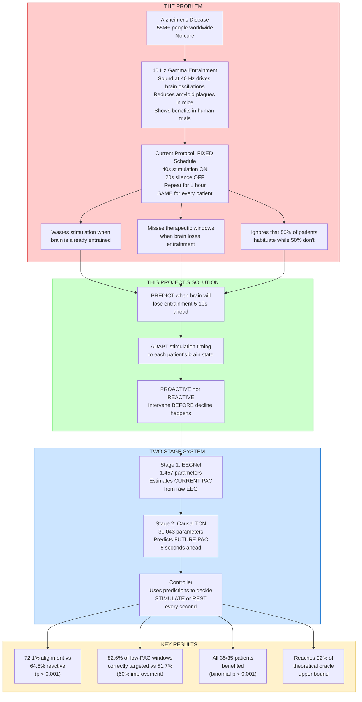

---

## 2. The Problem

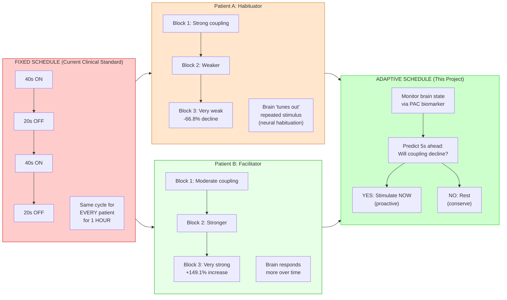

### Neural Habituation (Thompson & Spencer, 1966)

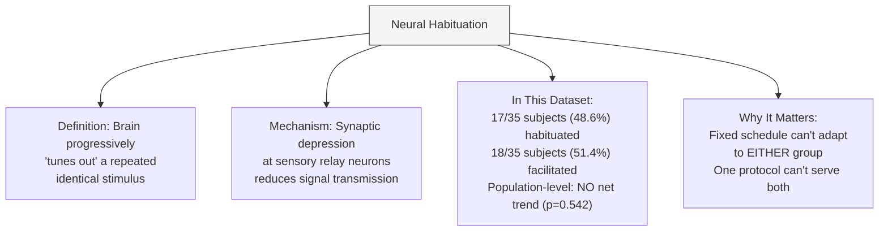

---

## 3. Project Evolution Timeline

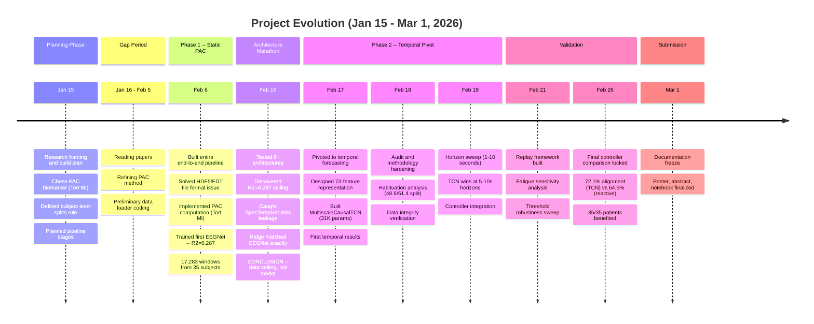

---

## 4. Repository Structure

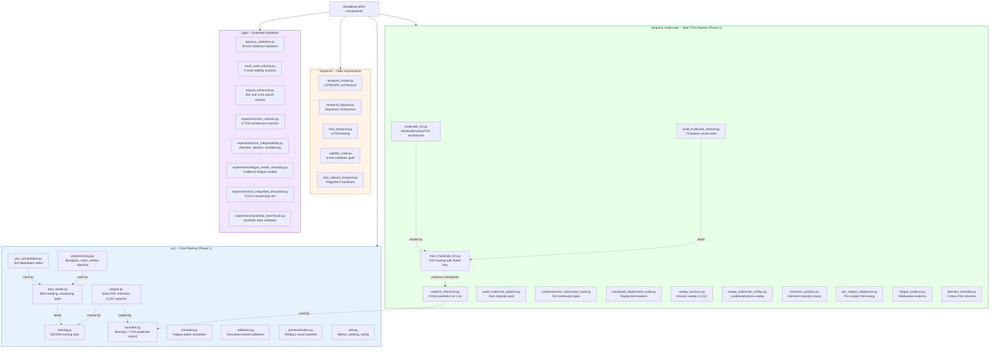

---

## 5. Data Pipeline

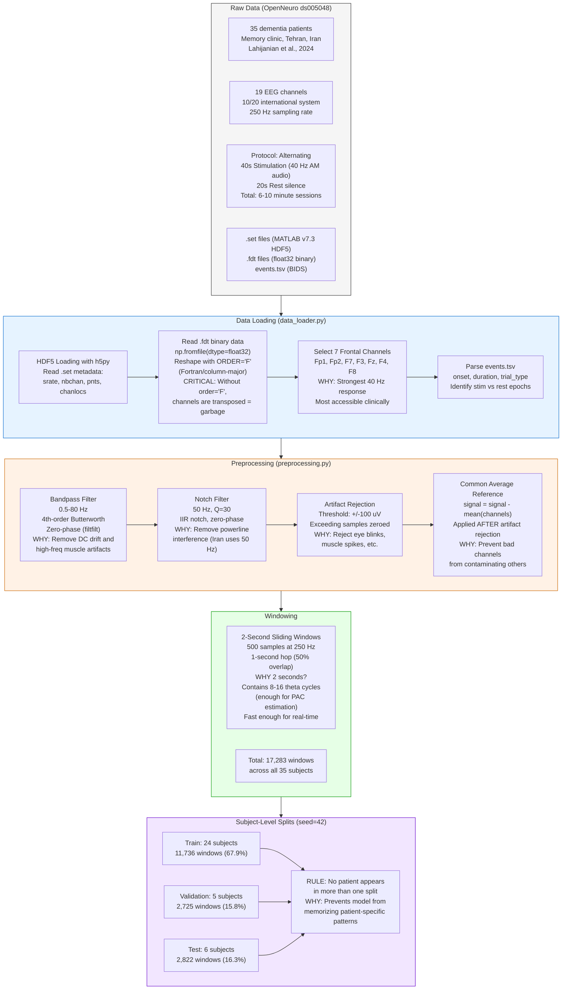

### Why 2-Second Windows?

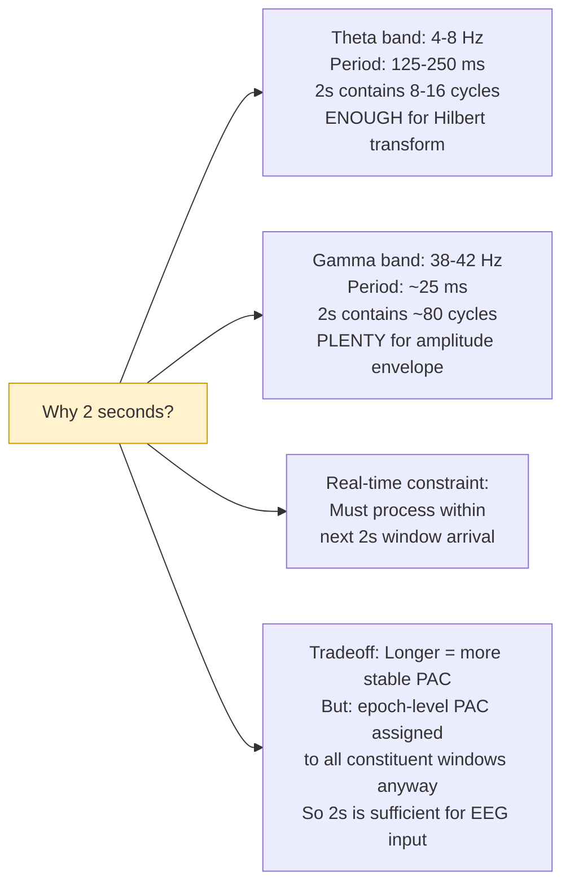

### Why Epoch-Level PAC Labels?

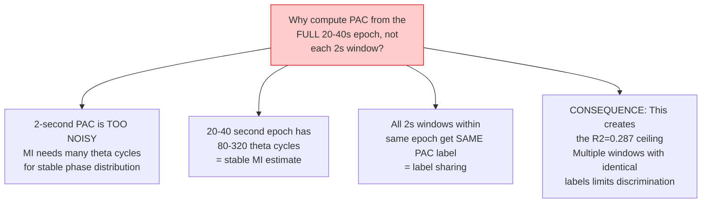

---

## 6. PAC Computation

```mermaid
flowchart TB
    subgraph PAC_WHAT["What is PAC?"]
        DEF["Phase-Amplitude Coupling (PAC)<br/>How strongly the AMPLITUDE of<br/>fast oscillations (gamma 38-42 Hz)<br/>is modulated by the PHASE of<br/>slow oscillations (theta 4-8 Hz)"]
        MEANING["High PAC = Brain is entrained<br/>= Gamma locked to theta<br/>= Therapy is working<br/><br/>Low PAC = Lost synchronization<br/>= Brain not responding<br/>= Need stimulation"]
        MEMORY["WHY theta-gamma coupling?<br/>Theta provides temporal windows<br/>for memory encoding<br/>Gamma bursts within theta = items<br/>This is how working memory works<br/>Canolty and Knight, 2010"]
    end

    subgraph TORT["Tort Modulation Index (Tort et al., 2010)"]
        direction TB
        STEP1["Step 1: Bandpass Filter<br/>Theta: 4-8 Hz (4th-order Butterworth)<br/>Gamma: 38-42 Hz (4th-order Butterworth)<br/>Zero-phase (filtfilt)"]
        STEP2["Step 2: Hilbert Transform<br/>Theta signal to instantaneous PHASE<br/>angle of hilbert of theta in -pi to pi<br/>Gamma signal to instantaneous AMPLITUDE<br/>abs of hilbert of gamma = envelope"]
        STEP3["Step 3: Phase Binning<br/>Divide -pi to pi into 18 bins<br/>Each bin = 20 degrees<br/>For each bin: compute MEAN<br/>gamma amplitude"]
        STEP4["Step 4: Normalize to Distribution<br/>P_i = mean_amp_i / sum(all_mean_amps)<br/>This is now a probability distribution<br/>If PAC = 0: uniform (all bins equal)<br/>If PAC > 0: non-uniform (some bins higher)"]
        STEP5["Step 5: KL Divergence<br/>KL = sum(P_i * log(P_i * n_bins))<br/>Measures distance from uniform<br/>Uniform = no coupling = KL = 0"]
        STEP6["Step 6: Normalize<br/>MI = KL / log of n_bins<br/>MI in range 0 to 1<br/>Typical values: 6e-6 to 7e-4<br/>Mean: ~4.4e-5"]

        STEP1 --> STEP2 --> STEP3 --> STEP4 --> STEP5 --> STEP6
    end

    PAC_WHAT --> TORT

    style PAC_WHAT fill:#e6f3ff,stroke:#0066cc
    style TORT fill:#fff2e6,stroke:#cc6600
```

### Why These Frequency Bands?

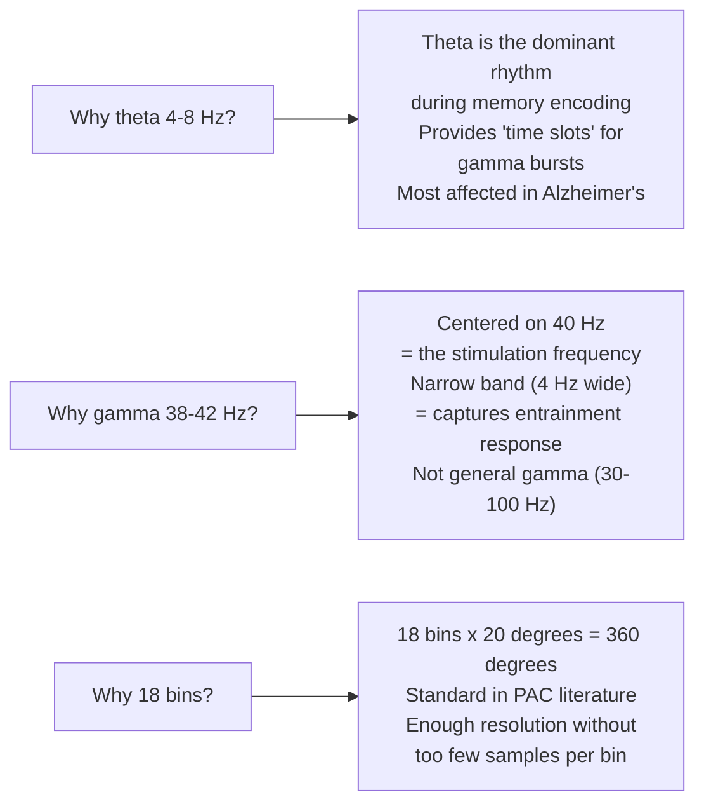

---

## 7. Phase 1: Architecture Marathon

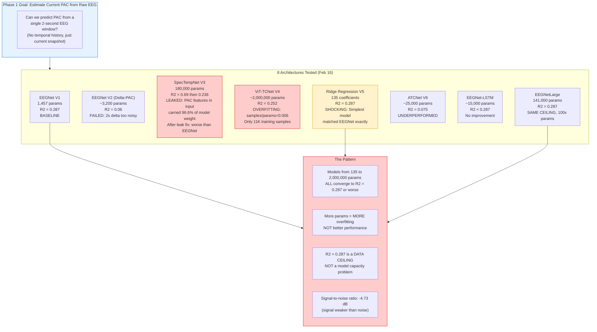

### EEGNet Architecture Detail

```mermaid
flowchart TB
    subgraph EEGNET["EEGNet (Lawhern et al., 2018) -- Adapted for Regression"]
        INPUT["Input: (batch, 1, 7, 500)<br/>1 feature map, 7 channels, 500 timepoints"]

        subgraph BLOCK1["Block 1: Temporal + Spatial Feature Extraction"]
            CONV1["Temporal Conv2d<br/>1 to 8 filters<br/>kernel 1x64 = 256ms at 250Hz<br/>Captures ~1 theta cycle<br/>padding 0,32 = same length"]
            BN1["BatchNorm2d(8)"]
            DW["Depthwise Spatial Conv2d<br/>8 to 16 filters, D=2<br/>kernel 7x1 = ALL 7 channels<br/>groups=8, each temporal filter<br/>gets its own spatial filter<br/>Learns channel relationships"]
            BN2["BatchNorm2d(16)"]
            ELU1["ELU activation"]
            POOL1["AvgPool2d 1x4<br/>Downsample: 500 to 125"]
            DROP1["Dropout(0.5)"]
        end

        subgraph BLOCK2["Block 2: Separable Convolution"]
            SEP1["Depthwise Conv2d<br/>16 to 16, kernel 1x16<br/>groups=16, per-channel"]
            SEP2["Pointwise Conv2d<br/>16 to 16, kernel 1x1<br/>Mixes channel information"]
            BN3["BatchNorm2d(16)"]
            ELU2["ELU activation"]
            POOL2["AvgPool2d 1x8<br/>Downsample: 125 to 15"]
            DROP2["Dropout(0.5)"]
        end

        subgraph HEAD["Regression Head"]
            FLAT["Flatten: 16 x 1 x 15 = 240"]
            FC["Linear 240 to 1<br/>Single output = PAC estimate"]
        end

        INPUT --> CONV1 --> BN1 --> DW --> BN2 --> ELU1 --> POOL1 --> DROP1
        DROP1 --> SEP1 --> SEP2 --> BN3 --> ELU2 --> POOL2 --> DROP2
        DROP2 --> FLAT --> FC
    end

    subgraph PARAMS["Parameter Count: 1,457 total"]
        P_CONV1["conv1: 8 x 1 x 64 = 512"]
        P_DW["depthwise: 16 x 1 x 7 = 112"]
        P_SEP1["separable1: 16 x 1 x 16 = 256"]
        P_SEP2["separable2: 16 x 16 x 1 = 256"]
        P_BN["BatchNorms: ~80"]
        P_FC["Linear: 240 + 1 = 241"]
    end

    subgraph WHY_EEGNET["Why EEGNet Won"]
        W1["Temporal conv captures<br/>frequency patterns (1 theta cycle)"]
        W2["Depthwise spatial conv captures<br/>cross-channel relationships<br/>(frontal topography)"]
        W3["Separable conv = parameter-efficient<br/>factorizes spatial+channel mixing"]
        W4["Dropout 0.5 = strong regularization<br/>prevents overfitting on 11K samples"]
        W5["Only 1,457 params for 11K samples<br/>= 8 samples per parameter<br/>(good ratio for regularization)"]
        W6["Inference: under 1ms on Apple Silicon<br/>= real-time capable"]
    end

    style EEGNET fill:#e6f3ff,stroke:#0066cc
    style PARAMS fill:#f5f5f5,stroke:#333
    style WHY_EEGNET fill:#e6ffe6,stroke:#009900
```

---

## 8. The R-squared = 0.287 Ceiling

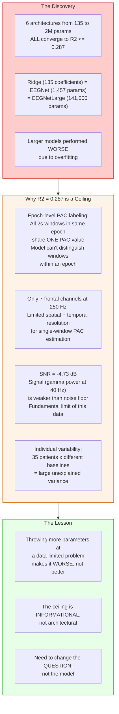

### The SpecTempNet Leakage Lesson

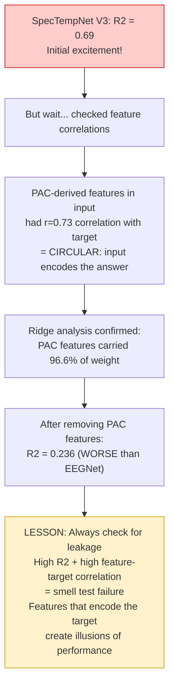

---

## 9. The Pivot

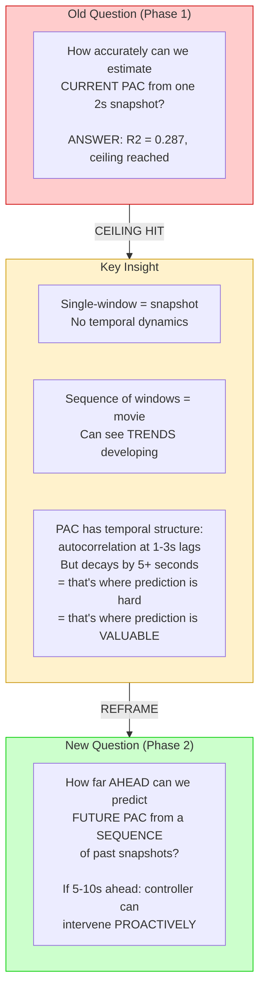

---

## 10. Feature Engineering: 73 Dimensions

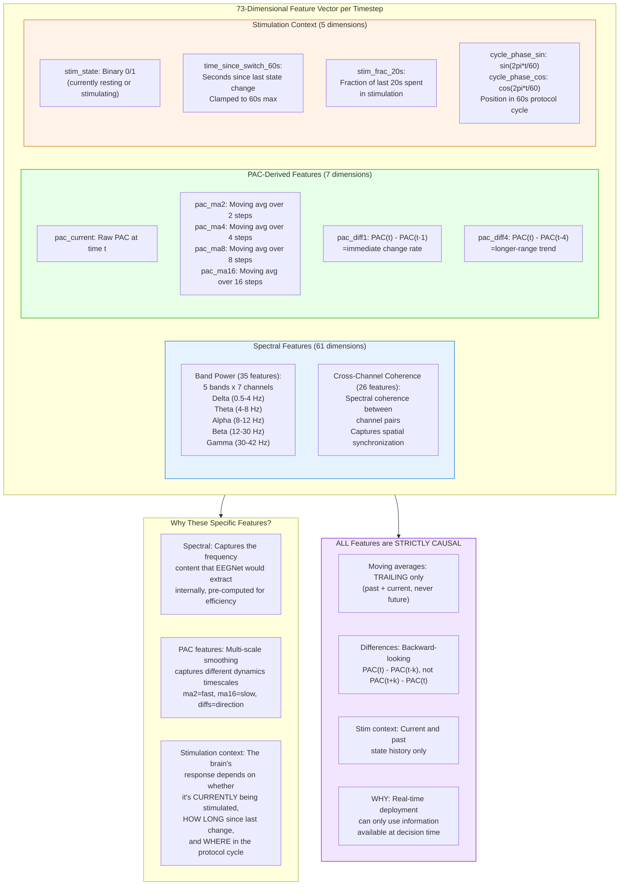

### Sequence Construction

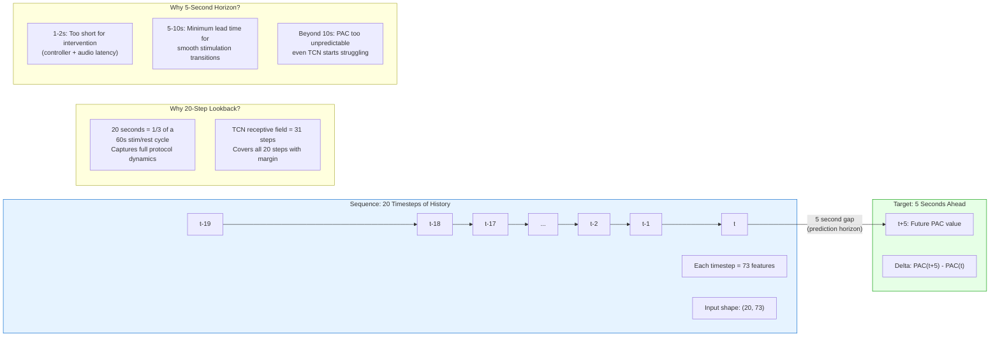

---

## 11. Causal TCN Architecture Deep Dive

```mermaid
flowchart TB
    subgraph TCN_ARCH["MultiscaleCausalTCN (31,043 parameters)"]
        INPUT_TCN["Input: (batch, 20, 73)<br/>20 timesteps x 73 features"]

        subgraph PROJ["Input Projection (4,800 params)"]
            LINEAR1["Linear 73 to 64<br/>4,672 weights + 64 bias"]
            LN1["LayerNorm(64)<br/>128 params (scale + shift)"]
            SILU1["SiLU activation<br/>(smooth ReLU variant)"]
        end

        TRANSPOSE["Transpose: B,20,64 to B,64,20<br/>Conv1d expects B, channels, time"]

        subgraph BLOCK1_TCN["TCN Block 1: Dilation=1 (4,416 params)"]
            CP1["Causal Pad: F.pad(x, (2, 0))<br/>Pad LEFT only, 2 zeros<br/>=(k-1)*d = (3-1)*1 = 2"]
            DW1_TCN["Depthwise Conv1d<br/>64ch, kernel=3, groups=64<br/>Each channel has own filter<br/>192 params"]
            PW1["Pointwise Conv1d<br/>64 to 64, kernel=1<br/>Cross-channel mixing<br/>4,096 params"]
            GN1["GroupNorm(1, 64)<br/>= Instance Norm<br/>128 params"]
            S1["SiLU + Dropout(0.1)"]
            RES1["+ Residual Connection"]
        end

        subgraph BLOCK2_TCN["TCN Block 2: Dilation=2 (4,416 params)"]
            CP2["Causal Pad: F.pad(x, (4, 0))<br/>=(3-1)*2 = 4 zeros left"]
            NOTE2["Same structure as Block 1<br/>but dilation=2<br/>Sees every OTHER timestep<br/>= 2-second patterns"]
        end

        subgraph BLOCK3_TCN["TCN Block 3: Dilation=4 (4,416 params)"]
            CP3["Causal Pad: F.pad(x, (8, 0))<br/>=(3-1)*4 = 8 zeros left"]
            NOTE3["Dilation=4<br/>Sees every 4th timestep<br/>= 4-second patterns"]
        end

        subgraph BLOCK4_TCN["TCN Block 4: Dilation=8 (4,416 params)"]
            CP4["Causal Pad: F.pad(x, (16, 0))<br/>=(3-1)*8 = 16 zeros left"]
            NOTE4["Dilation=8<br/>Sees every 8th timestep<br/>= 8-second patterns"]
        end

        subgraph POOL_TCN["Attention Pooling (65 params)"]
            ATT_CONV["Conv1d 64 to 1, kernel=1<br/>Produces attention logit per timestep"]
            SOFTMAX["Softmax over time dimension<br/>= learned importance weights"]
            WSUM["Weighted sum: B,64,20 x weights = B,64"]
        end

        subgraph HEADS["Dual Output Heads"]
            subgraph FUTURE_HEAD["Future Head (4,225 params)"]
                FH1["Linear 64 to 64 + SiLU"]
                FH2["Dropout 0.1"]
                FH3["Linear 64 to 1<br/>= Predicted Future PAC"]
            end
            subgraph DELTA_HEAD["Delta Head (4,225 params)"]
                DH1["Linear 64 to 64 + SiLU"]
                DH2["Dropout 0.1"]
                DH3["Linear 64 to 1<br/>= Predicted PAC Change"]
            end
        end

        INPUT_TCN --> PROJ
        LINEAR1 --> LN1 --> SILU1
        PROJ --> TRANSPOSE
        TRANSPOSE --> BLOCK1_TCN --> BLOCK2_TCN --> BLOCK3_TCN --> BLOCK4_TCN
        BLOCK4_TCN --> POOL_TCN
        POOL_TCN --> FUTURE_HEAD
        POOL_TCN --> DELTA_HEAD
    end

    style TCN_ARCH fill:#e6f3ff,stroke:#0066cc
    style PROJ fill:#f5f5f5,stroke:#333
    style HEADS fill:#e6ffe6,stroke:#009900
```

### Receptive Field Calculation

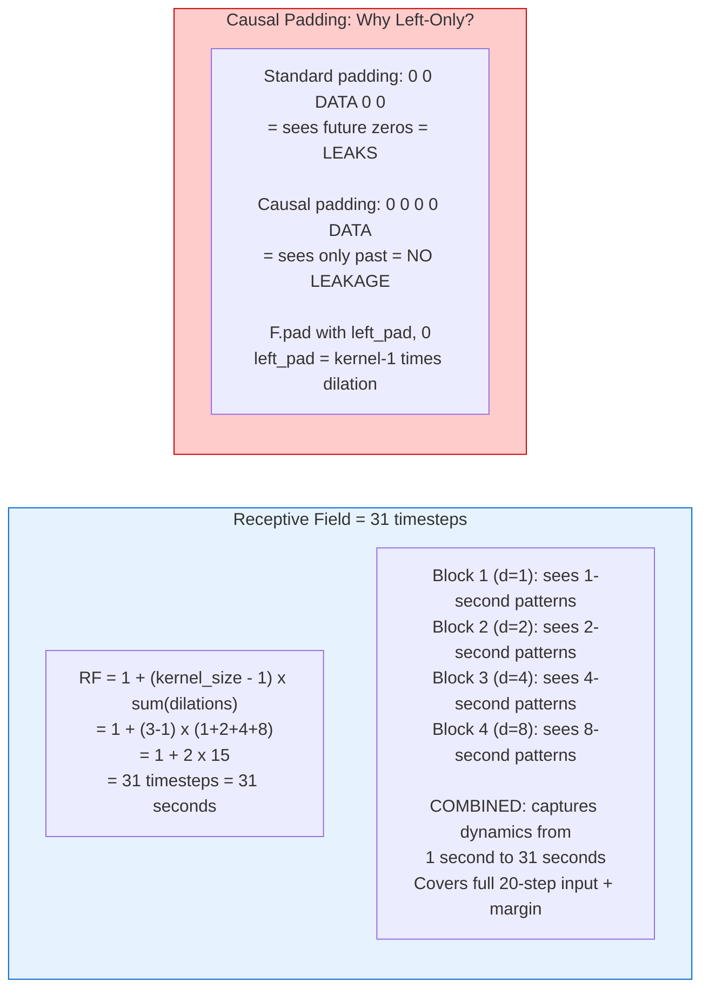

### Key Design Decisions Explained

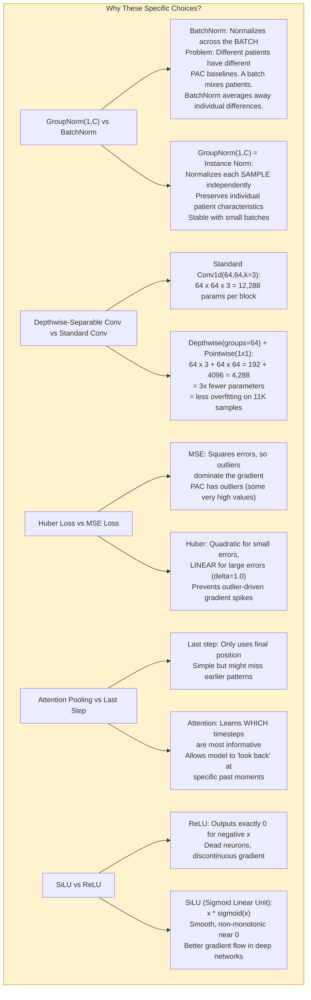

---

## 12. Why TCN Over Other Models?

```mermaid
flowchart TB
    subgraph ALTERNATIVES["Model Alternatives Considered"]
        LSTM_ALT["LSTM / GRU<br/>(tested in temporal/)"]
        LSTM_PRO["Pros: Good at sequences<br/>Standard choice for time series"]
        LSTM_CON["Cons:<br/>1. Bidirectional = not causal<br/>(sees 'future' within lookback)<br/>2. Sequential processing = slow<br/>3. Vanishing gradients for long sequences<br/>4. Harder to parallelize"]

        TRANS_ALT["Transformer<br/>(tested in rigor/tcn_variants.py)"]
        TRANS_PRO["Pros: Flexible attention<br/>Can learn variable-lag dependencies"]
        TRANS_CON["Cons:<br/>1. ~85K params (3x TCN)<br/>2. Quadratic attention cost O(T^2)<br/>3. Overfits on 11K samples<br/>4. Needs positional encoding"]

        RIDGE_ALT["Ridge Regression<br/>(always computed as baseline)"]
        RIDGE_PRO["Pros: Simple, interpretable<br/>Fast to train"]
        RIDGE_CON["Cons:<br/>1. Linear only -- can't model<br/>nonlinear PAC dynamics<br/>2. FAILS at 5-10s horizons<br/>(negative R2)"]

        PERSIST["Persistence<br/>(predict PAC stays same)"]
        PERSIST_PRO["Pros: Zero computation"]
        PERSIST_CON["Cons: Only works at 1-2s<br/>PAC autocorrelation decays<br/>to zero by 3-5 seconds"]
    end

    subgraph TCN_WIN["Why TCN Wins"]
        TCN_W1["Strictly causal architecture<br/>(left-only padding, no future leakage)"]
        TCN_W2["Parallel processing<br/>(all timesteps computed simultaneously,<br/>unlike LSTM's sequential processing)"]
        TCN_W3["Multi-scale patterns via dilations<br/>d=1: 1s patterns, d=2: 2s, d=4: 4s, d=8: 8s<br/>Captures dynamics at ALL timescales"]
        TCN_W4["Parameter efficient: 31K params<br/>(vs 85K Transformer, vs 15-25K LSTM<br/>but with better inductive bias)"]
        TCN_W5["Stable training: No vanishing gradients<br/>No attention-head collapse<br/>Residual connections + GroupNorm"]
        TCN_W6["Deterministic receptive field: 31 steps<br/>You KNOW exactly how far back it looks<br/>(unlike attention which is data-dependent)"]
    end

    ALTERNATIVES --> TCN_WIN

    style TCN_WIN fill:#ccffcc,stroke:#00cc00
    style LSTM_CON fill:#ffcccc,stroke:#cc0000
    style TRANS_CON fill:#ffcccc,stroke:#cc0000
    style RIDGE_CON fill:#ffcccc,stroke:#cc0000
    style PERSIST_CON fill:#ffcccc,stroke:#cc0000
```

### TCN Variants Tested in rigor/

```mermaid
flowchart TB
    subgraph VARIANTS["4 TCN Variants Tested"]
        VA["Variant A: DeepDilationTCN<br/>Dilations: 1,2,4,8,16,32<br/>RF=127 steps, ~2 minutes<br/>~42K params<br/>Hypothesis: Longer context helps"]
        VB["Variant B: MultiTaskTCN<br/>Same architecture as baseline<br/>BUT: delta_lambda=0.3, consistency=0.1<br/>31K params<br/>Hypothesis: Joint delta training helps"]
        VC["Variant C: WiderTCN<br/>hidden=128 vs 64<br/>~120K params, 4x baseline<br/>Hypothesis: 73 to 64 is a bottleneck"]
        VD["Variant D: TransformerTCN<br/>4-layer causal Transformer<br/>4 heads, d_model=64<br/>~85K params<br/>Hypothesis: Attention > fixed dilation"]

        BASELINE_TCN["Baseline: MultiscaleCausalTCN<br/>Dilations: 1,2,4,8<br/>hidden=64<br/>31K params<br/>THIS IS THE PRODUCTION MODEL"]
    end

    subgraph RESULT_VARIANTS["Result: Baseline held up"]
        RV1["Deeper dilations: marginal gain,<br/>not worth 30% more params"]
        RV2["Multi-task: slight improvement<br/>but disabled in production<br/>(lambda=0.0)"]
        RV3["Wider: overfitting on 11K samples"]
        RV4["Transformer: overfitting + slower"]
    end

    VARIANTS --> RESULT_VARIANTS

    style BASELINE_TCN fill:#ccffcc,stroke:#00cc00
```

---

## 13. Training Configuration

```mermaid
flowchart TB
    subgraph EEGNET_TRAIN["EEGNet Training (src/training.py)"]
        ET1["Loss: MSE (Mean Squared Error)<br/>WHY: Standard for regression,<br/>PAC values are small but smooth"]
        ET2["Optimizer: Adam<br/>lr=0.001, weight_decay=1e-4<br/>WHY: Adaptive learning rates,<br/>light L2 regularization"]
        ET3["Scheduler: ReduceLROnPlateau<br/>factor=0.5, patience=5<br/>Halves LR after 5 epochs<br/>without val loss improvement"]
        ET4["Gradient Clipping: max_norm=1.0<br/>WHY: Prevents gradient explosions<br/>from PAC outliers"]
        ET5["Early Stopping: patience=15<br/>Stops if val loss doesn't improve<br/>for 15 epochs"]
        ET6["Batch Size: 64<br/>Dropout: 0.5 (heavy regularization)"]
        ET7["PAC Normalization: z-score<br/>mean/std from TRAINING SET ONLY<br/>Stored in checkpoint for inference"]
    end

    subgraph TCN_TRAIN["Causal TCN Training (temporal_multiscale/train_multiscale_tcn.py)"]
        TT1["Loss: Huber (delta=1.0)<br/>WHY: Robust to PAC outliers<br/>Linear penalty for large errors"]
        TT2["Optimizer: AdamW<br/>lr=0.001, weight_decay=0.001<br/>WHY: Decoupled weight decay<br/>= better regularization than Adam"]
        TT3["Scheduler: ReduceLROnPlateau<br/>mode='max', factor=0.5, patience=5<br/>Monitoring val FUTURE R2<br/>(not loss, but actual metric)"]
        TT4["Gradient Clipping: max_norm=1.0"]
        TT5["Early Stopping: patience=20<br/>Monitoring val Future R2<br/>Best epoch: 53"]
        TT6["Batch Size: 128<br/>Dropout: 0.1 (lighter than EEGNet)"]
        TT7["Seeding: seed=42 everywhere<br/>random, numpy, torch, cuda<br/>cudnn.deterministic=True"]
        TT8["Feature Normalization: z-score<br/>TRAIN-ONLY statistics<br/>Saved in scalers.npz"]
    end

    style EEGNET_TRAIN fill:#e6f3ff,stroke:#0066cc
    style TCN_TRAIN fill:#e6ffe6,stroke:#009900
```

### What Each Hyperparameter Means

```mermaid
flowchart TB
    subgraph HYPERPARAMS["Hyperparameter Glossary"]
        HP1["LEARNING RATE (lr=0.001)<br/>How big each gradient step is<br/>Too high: overshoots, unstable<br/>Too low: trains forever<br/>0.001 is a safe default for Adam"]

        HP2["WEIGHT DECAY (1e-3 or 1e-4)<br/>L2 regularization penalty<br/>Penalizes large weights<br/>Prevents overfitting<br/>Higher = more regularization"]

        HP3["BATCH SIZE (64 or 128)<br/>Samples per gradient update<br/>Larger = more stable gradients<br/>Smaller = more noise = regularization<br/>64 for EEGNet (smaller model)<br/>128 for TCN (larger model)"]

        HP4["DROPOUT (0.5 or 0.1)<br/>Randomly zeroes neurons<br/>Forces redundancy in representations<br/>0.5 = aggressive (EEGNet, prevents overfitting)<br/>0.1 = light (TCN, with GroupNorm already)"]

        HP5["PATIENCE (15 or 20)<br/>Epochs without improvement<br/>before stopping training<br/>Prevents wasted computation<br/>and overfitting to training noise"]

        HP6["GRADIENT CLIPPING (max_norm=1.0)<br/>Caps gradient magnitude<br/>Prevents explosive updates<br/>from outlier samples"]

        HP7["HUBER DELTA (1.0)<br/>Threshold between quadratic and linear<br/>Errors < 1.0: squared (like MSE)<br/>Errors > 1.0: linear (robust to outliers)"]
    end

    style HYPERPARAMS fill:#fff2cc,stroke:#cc9900
```

---

## 14. Horizon Sweep

```mermaid
flowchart TB
    subgraph SWEEP["Prediction Horizon Sweep: Where TCN Adds Value"]
        subgraph H1["Horizon 1s"]
            H1P["Persistence: R2=0.760"]
            H1R["Ridge: R2=0.812"]
            H1T["TCN: R2=0.735"]
            H1W["WINNER: Ridge<br/>PAC barely changes in 1s<br/>Simple copy is great"]
        end

        subgraph H2["Horizon 2s"]
            H2P["Persistence: R2=0.488"]
            H2R["Ridge: R2=0.542"]
            H2T["TCN: R2=0.470"]
            H2W["WINNER: Ridge<br/>Still easy enough for linear"]
        end

        subgraph H3["Horizon 3s (CROSSOVER)"]
            H3P["Persistence: R2=0.234"]
            H3R["Ridge: R2=0.254"]
            H3T["TCN: R2=0.277"]
            H3W["WINNER: TCN starts winning<br/>PAC autocorrelation decaying"]
        end

        subgraph H5["Horizon 5s (PRIMARY)"]
            H5P["Persistence: R2=-0.267"]
            H5R["Ridge: R2=-0.393"]
            H5T["TCN: R2=+0.254"]
            H5W["WINNER: TCN by +0.52 margin<br/>Baselines COLLAPSE<br/>Worse than predicting the mean"]
        end

        subgraph H8["Horizon 8s"]
            H8P["Persistence: R2=-0.276"]
            H8R["Ridge: R2=-0.211"]
            H8T["TCN: R2=+0.240"]
            H8W["WINNER: TCN holds steady"]
        end

        subgraph H10["Horizon 10s"]
            H10P["Persistence: R2=-0.256"]
            H10R["Ridge: R2=-0.212"]
            H10T["TCN: R2=+0.278"]
            H10W["WINNER: TCN still positive"]
        end
    end

    subgraph WHY_PATTERN["Why This Pattern?"]
        WP1["At 1-2s: PAC autocorrelation is HIGH<br/>Value at t+1 is ~same as t<br/>Persistence works great, TCN overhead is waste"]
        WP2["At 3s: Autocorrelation decays to weak levels<br/>TCN's nonlinear modeling starts helping"]
        WP3["At 5-10s: Autocorrelation near ZERO<br/>Persistence = random = negative R2<br/>Ridge = linear, can't capture nonlinear dynamics<br/>TCN = dilated convolutions capture multi-scale<br/>temporal patterns that LINEAR models miss"]
        WP4["KEY: 5-10s is the CLINICALLY RELEVANT range<br/>This is enough lead time for controller to<br/>process prediction + transition audio smoothly"]
    end

    style H5 fill:#ccffcc,stroke:#00cc00
    style H8 fill:#ccffcc,stroke:#00cc00
    style H10 fill:#ccffcc,stroke:#00cc00
    style H1 fill:#f5f5f5,stroke:#999
    style H2 fill:#f5f5f5,stroke:#999
```

### Why Negative R-squared?

```mermaid
flowchart TD
    Q_NEG["What does NEGATIVE R2 mean?"]
    Q_NEG --> DEF["R2 = 1 - (sum of squared errors) / (sum of squared deviations from mean)<br/><br/>R2 = 1.0: Perfect prediction<br/>R2 = 0.0: Predicting the mean would be just as good<br/>R2 < 0.0: Predictions are WORSE than just<br/>predicting the mean every time"]
    DEF --> MEANING["Persistence at 5s: R2 = -0.267<br/>Meaning: Saying 'PAC will stay the same'<br/>is WORSE than saying 'PAC will be average'<br/>Because PAC changes A LOT in 5 seconds"]
    MEANING --> TCN_VALUE["TCN at 5s: R2 = +0.254<br/>Not amazing, but POSITIVE<br/>= TCN captures SOME real structure<br/>at a horizon where everything else fails<br/>This is the ONLY useful predictor here"]

    style Q_NEG fill:#fff2cc,stroke:#cc9900
```

---

## 15. Controller Pipeline

```mermaid
flowchart TB
    subgraph PIPELINE["Full Two-Stage Controller Pipeline"]
        EEG_IN["Patient wearing EEG headset<br/>7 frontal channels<br/>250 Hz sampling"]

        subgraph STAGE1["Stage 1: EEGNet (Current PAC Estimate)"]
            RAW["Raw EEG window<br/>(7ch x 500 samples = 2s)"]
            EEGNET_INF["EEGNet Forward Pass<br/>1,457 parameters<br/>Inference: under 1ms"]
            PAC_EST["Current PAC Estimate<br/>(z-score normalized)"]
        end

        subgraph FEAT_EXT["Feature Extraction (73 dimensions)"]
            SPEC_EXT["Spectral: FFT on current window<br/>5 bands x 7 channels + 26 coherence<br/>= 61 features"]
            PAC_FEAT_EXT["PAC-derived: current + 4 moving avgs<br/>+ 2 differences = 7 features"]
            STIM_CONTEXT["Stim context: on/off, time since switch,<br/>fraction, cycle phase = 5 features"]
        end

        subgraph STAGE2["Stage 2: Causal TCN (Future PAC Prediction)"]
            SEQ_BUF["Sequence Buffer<br/>Rolling deque of last 20 feature vectors<br/>(20 timesteps x 73 features)"]
            TCN_INF["TCN Forward Pass<br/>31,043 parameters"]
            PRED["Predicted Future PAC (5s ahead)<br/>Predicted Delta PAC"]
        end

        subgraph PERSONAL["Personalization Module"]
            ROLL_BUF["Rolling Buffer<br/>Last 30 PAC estimates<br/>(circular deque, maxlen=30)"]
            ZSCORE["Z-Score Computation<br/>z = (PAC_current - mean) / std<br/>Needs minimum 10 samples"]
        end

        subgraph DECISION["Controller Decision Logic"]
            subgraph REACTIVE["Reactive Path"]
                RZ_LOW["z < -0.5<br/>PAC below baseline<br/>= weak coupling"]
                RZ_HIGH["z > +0.5<br/>PAC above baseline<br/>= strong coupling"]
                RZ_MID["-0.5 <= z <= +0.5<br/>= normal range"]
            end

            subgraph PREDICTIVE["TCN Predictive Path (Priority)"]
                DECLINE["delta_pac < -0.3<br/>TCN predicts DECLINE<br/>= STIMULATE proactively"]
                RISE["delta_pac > +0.3<br/>TCN predicts RISE<br/>= REST proactively"]
                DEADZONE["abs delta_pac at most 0.3<br/>= Fall back to reactive"]
            end

            HYSTERESIS["Hysteresis: Must stay in current<br/>state for minimum 5 seconds<br/>before switching<br/>WHY: Prevents rapid oscillation<br/>between STIM and REST"]
        end

        subgraph OUTPUT["Output"]
            STIM["STIMULATE<br/>Turn ON 40 Hz audio"]
            REST["REST<br/>Turn OFF audio"]
        end

        EEG_IN --> RAW --> EEGNET_INF --> PAC_EST
        PAC_EST --> FEAT_EXT
        PAC_EST --> PERSONAL
        FEAT_EXT --> SEQ_BUF --> TCN_INF --> PRED
        PRED --> PREDICTIVE
        PERSONAL --> ZSCORE
        ZSCORE --> REACTIVE
        PREDICTIVE -->|"dead zone"| REACTIVE
        PREDICTIVE --> HYSTERESIS
        REACTIVE --> HYSTERESIS
        HYSTERESIS --> STIM
        HYSTERESIS --> REST
    end

    subgraph LATENCY["System Performance"]
        LAT1["EEGNet: under 1ms"]
        LAT2["Feature extraction: under 1ms"]
        LAT3["TCN: under 3ms"]
        LAT4["Control logic: under 1ms"]
        LAT5["Total: under 5ms end-to-end"]
        LAT6["Decision rate: 1 Hz, 1 per second"]
        LAT7["Memory: under 100 MB"]
    end

    style PIPELINE fill:#f5f5f5,stroke:#333
    style STAGE1 fill:#e6f3ff,stroke:#0066cc
    style STAGE2 fill:#e6ffe6,stroke:#009900
    style DECISION fill:#fff2e6,stroke:#cc6600
    style PREDICTIVE fill:#ccffcc,stroke:#00cc00
```

### Four Controllers Compared

```mermaid
flowchart LR
    subgraph C1["Fixed Schedule<br/>(Clinical Standard)"]
        C1D["40s ON, 20s OFF<br/>No brain feedback<br/>Same for everyone"]
        C1R["Alignment: 45.0%<br/>PAC Gap: -6.6<br/>(WRONG direction)<br/>Stim: 66.6%"]
    end

    subgraph C2["Reactive Threshold"]
        C2D["z-score on CURRENT PAC<br/>z < -0.5: stimulate<br/>z > +0.5: rest"]
        C2R["Alignment: 64.5%<br/>Low-PAC targeting: 51.7%<br/>PAC Gap: +21.1<br/>Stim: 36.7%"]
    end

    subgraph C3["TCN Predictive<br/>(THIS PROJECT)"]
        C3D["z-score + TCN 5s lookahead<br/>Predicted decline: stimulate<br/>Predicted rise: rest"]
        C3R["Alignment: 72.1%<br/>Low-PAC targeting: 82.6%<br/>PAC Gap: +30.5<br/>Stim: 59.7%"]
    end

    subgraph C4["Oracle (Upper Bound)"]
        C4D["Perfect future knowledge<br/>Theoretical maximum<br/>Not achievable in practice"]
        C4R["Alignment: 100%<br/>Low-PAC targeting: 100%<br/>PAC Gap: +33.3<br/>Stim: 48.3%"]
    end

    C1 --> C2 --> C3 --> C4

    style C1 fill:#ffcccc,stroke:#cc0000
    style C2 fill:#fff2e6,stroke:#cc6600
    style C3 fill:#ccffcc,stroke:#00cc00
    style C4 fill:#e6f3ff,stroke:#0066cc
```

---

## 16. Validation Framework

```mermaid
flowchart TB
    subgraph VAL_METHODS["Two Validation Protocols"]
        subgraph PRIMARY["Primary: Real-Data Replay (MAIN RESULT)"]
            PR1["Take all 35 subjects'<br/>actual EEG recordings"]
            PR2["Feed through controller<br/>window by window"]
            PR3["Controller makes STIM/REST<br/>decision at each 2s window"]
            PR4["Compare decisions against<br/>ground-truth PAC values"]
            PR5["Compute alignment, targeting,<br/>PAC gap metrics"]
            PR_NOTE["NOTE: Uses ground-truth PAC<br/>as TCN input (not EEGNet estimates)<br/>to isolate TCN's predictive contribution<br/>from EEGNet estimation error"]
        end

        subgraph SECONDARY["Secondary: Closed-Loop Simulation"]
            SC1["EntrainmentSimulator generates<br/>synthetic PAC trajectories"]
            SC2["Controller decisions AFFECT<br/>the simulation (true closed-loop)"]
            SC3["Tests fatigue sensitivity<br/>across 6 severity levels"]
            SC4["Tests 4 different fatigue<br/>model assumptions"]
            SC5["50 trials x 600 seconds each<br/>per condition"]
        end
    end

    subgraph METRICS_DEF["Metric Definitions"]
        M_ALIGN["ALIGNMENT = (Low-PAC Stim Rate +<br/>High-PAC Rest Rate) / 2<br/>= balanced accuracy<br/>of therapeutic targeting"]
        M_LOWPAC["LOW-PAC TARGETING = % of<br/>below-median PAC windows where<br/>controller stimulates<br/>= 'Did we treat when brain needed it?'"]
        M_GAP["PAC GAP = mean PAC during REST<br/>minus mean PAC during STIM<br/>Positive = correct direction<br/>(stimulating low PAC, resting high PAC)"]
        M_UTIL["CLINICAL UTILITY = composite<br/>combining alignment, targeting,<br/>and efficiency"]
    end

    subgraph STATS["Statistical Tests"]
        ST1["Wilcoxon Signed-Rank Test<br/>Non-parametric PAIRED test<br/>WHY: Controller metrics may not<br/>be normally distributed<br/>Paired = same subjects, different controllers"]
        ST2["Hedges g Effect Size<br/>Bias-corrected standardized mean difference<br/>Below 0.2: negligible<br/>0.2-0.5: small<br/>0.5-0.8: medium<br/>Above 0.8: LARGE, all our results are large"]
        ST3["Bootstrap 95% CI<br/>1000 resamples<br/>Non-parametric confidence intervals"]
        ST4["Binomial Test<br/>35/35 subjects improved<br/>p < 0.001 under null (50/50 chance)"]
    end

    style PRIMARY fill:#ccffcc,stroke:#00cc00
    style SECONDARY fill:#e6f3ff,stroke:#0066cc
```

### Data Integrity Checks

```mermaid
flowchart TB
    subgraph INTEGRITY["Data Integrity Verification"]
        CHECK1["Subject Leakage: PASS<br/>Zero overlap between<br/>train/val/test subject sets"]
        CHECK2["Temporal Causality: PASS<br/>target_idx > end_idx<br/>for every sequence<br/>(target strictly after input)"]
        CHECK3["Normalization Leakage: PASS<br/>Scalers fit on TRAINING data only<br/>Applied to val/test without refitting"]
        CHECK4["Shuffle-Label Sanity: R2=-0.332<br/>Random permutation of PAC labels<br/>destroys performance = real signal"]
        CHECK5["Feature-Target Correlation:<br/>No input feature exceeds r=0.5<br/>with target (after SpecTempNet lesson)"]
        CHECK6["Persistence Baseline: Matches<br/>expected values at all horizons<br/>(independent verification)"]
    end

    style INTEGRITY fill:#e6ffe6,stroke:#009900
```

---

## 17. Results Summary

```mermaid
flowchart TB
    subgraph RESULT1["Result 1: TCN Outperforms All Alternatives"]
        R1T["On all 35 subjects' real EEG:"]
        R1A["Alignment: 72.1% (TCN) vs 64.5% (Reactive)<br/>Hedges' g = 1.31, p < 0.001"]
        R1B["Low-PAC Targeting: 82.6% vs 51.7%<br/>Hedges' g = 4.47, p < 0.001<br/>(60% improvement in targeting)"]
        R1C["PAC Gap: +30.5 vs +21.1<br/>Hedges' g = 1.57, p < 0.001"]
        R1D["TCN reaches 30.5/33.3 = 92%<br/>of theoretical oracle bound"]
        R1E["Uses LESS stim than Fixed:<br/>59.7% vs 66.6%"]
    end

    subgraph RESULT2["Result 2: Every Patient Benefits"]
        R2A["35/35 subjects show higher<br/>utility with TCN vs Reactive"]
        R2B["Binomial p < 0.001<br/>(probability of 35/35 by chance<br/>if true probability were 50%)"]
        R2C["Holds for 6 test subjects<br/>never seen during training"]
    end

    subgraph RESULT3["Result 3: Advantage Grows with Fatigue"]
        R3A["No fatigue: +9.5%<br/>Mild: +10.0%<br/>Moderate: +9.0%<br/>High: +10.8%<br/>Severe: +11.2%"]
        R3B["All p < 0.001<br/>Hedges' g = 1.7-2.4<br/>(large to very large)"]
        R3C["Even without fatigue: +9.5%<br/>Adaptive helps with NATURAL<br/>PAC fluctuations too"]
    end

    subgraph RESULT4["Result 4: Robust Across Fatigue Models"]
        R4A["Exponential Decay: +9.0%, g=2.31<br/>Step Function: +6.9%, g=1.21<br/>Heterogeneous (50/50): +8.9%, g=1.71<br/>Saturation (synaptic): +19.0%, g=3.66"]
        R4B["ALL four models significant<br/>at p < 10^-13"]
        R4C["Results are NOT artifacts of<br/>any specific fatigue assumption"]
    end

    subgraph RESULT5["Result 5: Habituation Validates the Premise"]
        R5A["17/35 (48.6%) habituate<br/>18/35 (51.4%) facilitate<br/>Population-level: no trend (p=0.542)"]
        R5B["The two groups cancel out<br/>= fixed schedule cannot serve both"]
        R5C["Individual range: -66.8% to +149.1%<br/>= huge variability between patients"]
    end

    style RESULT1 fill:#ccffcc,stroke:#00cc00
    style RESULT2 fill:#ccffcc,stroke:#00cc00
    style RESULT3 fill:#e6ffe6,stroke:#009900
    style RESULT4 fill:#e6ffe6,stroke:#009900
    style RESULT5 fill:#fff2cc,stroke:#cc9900
```

---

## 18. Statistical Rigor and Robustness

```mermaid
flowchart TB
    subgraph RIGOR["Layers of Validation"]
        subgraph LAYER1["Layer 1: Data Integrity"]
            L1A["Subject-disjoint splits"]
            L1B["Temporal causality verification"]
            L1C["Train-only normalization"]
            L1D["Shuffle-label sanity check"]
        end

        subgraph LAYER2["Layer 2: Model Capacity Analysis"]
            L2A["8 architectures tested<br/>(135 to 2M params)"]
            L2B["R2 ceiling confirmed at 0.287"]
            L2C["Multi-seed training (5 seeds)<br/>with independent re-splits"]
            L2D["Enhanced EEGNet variants<br/>(35K and 141K params)"]
        end

        subgraph LAYER3["Layer 3: Architecture Exploration"]
            L3A["4 TCN variants compared<br/>(Deep, MultiTask, Wide, Transformer)"]
            L3B["Synthetic data benchmark<br/>(validates correctness first)"]
            L3C["Baseline held as best<br/>parameter-efficiency winner"]
        end

        subgraph LAYER4["Layer 4: Controller Validation"]
            L4A["6 controllers compared<br/>on real data (35 subjects)"]
            L4B["Wilcoxon signed-rank tests"]
            L4C["Hedges' g effect sizes"]
            L4D["Bootstrap 95% CIs"]
            L4E["Threshold robustness sweep<br/>(delta-z = 0.1 to 1.0)"]
        end

        subgraph LAYER5["Layer 5: Simulation Robustness"]
            L5A["50 trials x 600s per condition"]
            L5B["6 fatigue severity levels"]
            L5C["4 fatigue model assumptions"]
            L5D["Population-diverse parameters"]
            L5E["TCN-in-the-loop simulation"]
        end

        subgraph LAYER6["Layer 6: Interpretability"]
            L6A["Attention weight analysis<br/>(which timesteps matter)"]
            L6B["Feature group ablation<br/>(PAC vs spectral vs stim)"]
            L6C["Stim-conditional performance<br/>(stim vs rest, transition vs steady)"]
        end
    end

    LAYER1 --> LAYER2 --> LAYER3 --> LAYER4 --> LAYER5 --> LAYER6

    style LAYER1 fill:#e6f3ff,stroke:#0066cc
    style LAYER2 fill:#e6ffe6,stroke:#009900
    style LAYER3 fill:#fff2e6,stroke:#cc6600
    style LAYER4 fill:#f2e6ff,stroke:#6600cc
    style LAYER5 fill:#ffcccc,stroke:#cc0000
    style LAYER6 fill:#fff2cc,stroke:#cc9900
```

---

## 19. Key Terms Glossary

```mermaid
mindmap
  root((Key Terms<br/>for Judges))
    Neuroscience
      Gamma Oscillations
        30-100 Hz brain waves
        Essential for memory and attention
        Generated by PV interneurons
        Disrupted in Alzheimer's
      Theta Oscillations
        4-8 Hz brain waves
        Dominant during memory encoding
        Provides temporal windows
      Phase-Amplitude Coupling PAC
        How gamma amplitude
        locks to theta phase
        Measured by Modulation Index
        High PAC = entrained
        Low PAC = needs stimulation
      Neural Habituation
        Brain tunes out repeated stimulus
        Response progressively weakens
        Thompson and Spencer 1966
      Entrainment
        External stimulus drives brain
        to oscillate at matching frequency
        40 Hz sound drives gamma
      Microglia
        Brain immune cells
        Activated by 40 Hz stimulation
        Clear amyloid plaques
    Signal Processing
      Bandpass Filter
        Passes frequencies in a range
        Blocks everything outside
        4th-order Butterworth
      Hilbert Transform
        Extracts instantaneous
        phase and amplitude envelope
        from a narrowband signal
      KL Divergence
        Kullback-Leibler divergence
        Measures distance between
        two probability distributions
      Z-Score
        Standard deviations from mean
        z = x minus mean over std
        Normalizes across patients
      Modulation Index MI
        Tort et al 2010
        KL divergence normalized
        by log of num bins
    Machine Learning
      EEGNet
        Compact CNN for EEG
        Temporal then spatial convolutions
        Lawhern et al 2018
      TCN
        Temporal Convolutional Network
        Dilated causal convolutions
        Parallel not sequential
      Causal
        Model cannot see future data
        Left-only padding
        Essential for real-time
      Dilated Convolution
        Kernel with gaps
        Dilation 1 2 4 8
        Exponentially growing receptive field
      Depthwise Separable Conv
        Factorizes spatial and channel
        mixing for fewer parameters
      R-squared
        Fraction of variance explained
        1.0 = perfect
        0.0 = predicting the mean
        Negative = worse than mean
      Huber Loss
        Quadratic for small errors
        Linear for large errors
        Robust to outliers
      Overfitting
        Model memorizes training data
        Fails on new data
        More params with little data
      Early Stopping
        Stop training when validation
        metric stops improving
    Study Design
      Subject-Level Split
        No patient in multiple splits
        Prevents memorization of
        patient-specific patterns
      Offline Replay
        Replay recorded EEG through
        controller post-hoc
        Counterfactual analysis
      Hedges g Effect Size
        Standardized mean difference
        Bias-corrected
        Greater than 0.8 = large effect
      Wilcoxon Signed-Rank
        Non-parametric paired test
        Does not assume normality
      Bootstrap CI
        Resample data 1000 times
        Get distribution of statistic
        95 percent bounds
```

---

## 20. Likely Judge Questions and Answers

```mermaid
flowchart TB
    subgraph QA["Anticipated Judge Questions"]
        Q1["Q: Why not just use a simpler threshold?"]
        A1["A: Reactive threshold MISSES 48% of low-PAC<br/>windows that need treatment. It can only react<br/>AFTER decline has already occurred. TCN predicts<br/>5 seconds ahead, catching decline before it happens."]

        Q2["Q: R2=0.25 at 5s -- isn't that low?"]
        A2["A: At 5s horizons, EVERY other method has<br/>NEGATIVE R2 (worse than predicting the mean).<br/>+0.25 vs -0.27 is a +0.52 margin. And when<br/>integrated into the controller, it achieves 92%<br/>of the theoretical oracle. The prediction doesn't<br/>need to be perfect -- just directionally correct."]

        Q3["Q: This is offline replay, not real-time. Is it valid?"]
        A3["A: Yes, with a caveat. The system makes decisions<br/>on REAL brain data from 35 real patients.<br/>The limitation is that we can't observe the brain's<br/>RESPONSE to our decisions. This is the standard<br/>validation approach when live EEG streaming<br/>isn't available. Full closed-loop is future work."]

        Q4["Q: Why did you choose 7 frontal channels?"]
        A4["A: Frontal regions (Fp1, Fp2, F7, F3, Fz, F4, F8)<br/>show the STRONGEST 40 Hz entrainment response.<br/>They're also the most accessible in clinical EEG setups.<br/>Using all 19 channels would add noise from regions<br/>that don't respond well to 40 Hz auditory stimulation."]

        Q5["Q: How do you ensure no data leakage?"]
        A5["A: Three layers: (1) Subject-level splits -- no patient<br/>in multiple splits. (2) Temporal causality -- target index<br/>always after sequence end. (3) Train-only normalization --<br/>scalers computed from training data, applied to all.<br/>Plus shuffle-label sanity check: R2=-0.332 on random<br/>labels confirms the model learns real patterns."]

        Q6["Q: Why PAC as the biomarker, not spectral power?"]
        A6["A: PAC measures the COUPLING between theta and<br/>gamma, which is the neural mechanism for memory<br/>encoding. Spectral power just measures energy.<br/>PAC is the strongest predictor of working memory<br/>performance in AD, beta=0.693, p well under 0.001.<br/>High PAC = therapy working; low PAC = needs help."]

        Q7["Q: Could this run on an embedded device?"]
        A7["A: Yes. EEGNet: 1,457 params, under 1ms inference.<br/>TCN: 31,043 params, under 3ms inference.<br/>Total: under 5ms, under 100MB memory, 1 Hz decisions.<br/>Runs on Apple Silicon MPS without GPU.<br/>Small enough for a Raspberry Pi or clinical tablet."]

        Q8["Q: What about the 30% non-responders?"]
        A8["A: In our dataset, 48.6% habituate and 51.4%<br/>facilitate. The adaptive controller helps BOTH groups:<br/>habituators get more rest (reducing fatigue),<br/>facilitators get maintained stimulation.<br/>35/35 subjects benefited, including both groups."]
    end

    style QA fill:#f5f5f5,stroke:#333
```

---

## End-to-End System Flow (Complete)

```mermaid
flowchart TB
    subgraph DATA_PHASE["DATA PHASE"]
        RAW_DATA["OpenNeuro ds005048<br/>35 patients, 19ch EEG, 250Hz"]
        LOAD["data_loader.py<br/>HDF5 + FDT loading<br/>order='F' critical"]
        SELECT["7 frontal channels<br/>Fp1 Fp2 F7 F3 Fz F4 F8"]
        PREPROC["preprocessing.py<br/>Bandpass 0.5-80Hz<br/>Notch 50Hz<br/>Artifact reject +-100uV<br/>Common average reference"]
        COMPUTE_PAC["pac_computation.py<br/>Tort MI: theta(4-8Hz) phase<br/>gamma(38-42Hz) amplitude<br/>18 bins, KL divergence"]
        WINDOW["2s windows, 1s hop<br/>17,283 total windows<br/>Epoch-level PAC labels"]
        SPLIT["Subject splits (seed=42)<br/>24 train / 5 val / 6 test"]
    end

    subgraph PHASE1["PHASE 1: STATIC PAC ESTIMATION"]
        TRAIN_EN["training.py<br/>MSE loss, Adam(lr=0.001)<br/>Grad clip 1.0<br/>Early stop patience=15"]
        EEGNET_M["EEGNet<br/>1,457 params<br/>Temporal + Depthwise spatial<br/>+ Separable conv"]
        CEILING["R2 = 0.287 CEILING<br/>8 architectures tested<br/>All converge or worse"]
    end

    subgraph PIVOT_PHASE["PIVOT: REFRAME THE QUESTION"]
        OLD["Can we estimate current PAC<br/>better? NO -- data ceiling"]
        NEW["Can we predict future PAC<br/>from a sequence? YES"]
    end

    subgraph PHASE2["PHASE 2: TEMPORAL FORECASTING"]
        FEAT_BUILD["build_multiscale_dataset.py<br/>73 features: 61 spectral +<br/>7 PAC-derived + 5 stim context"]
        SEQ["Sequences: 20 steps lookback<br/>Target: 5 steps ahead<br/>Z-score normalized (train only)"]
        TCN_MODEL["MultiscaleCausalTCN<br/>31,043 params<br/>Dilations 1,2,4,8<br/>RF=31 steps<br/>Attention pooling<br/>Dual heads: future + delta"]
        TRAIN_TCN["train_multiscale_tcn.py<br/>Huber loss, AdamW(lr=0.001)<br/>Grad clip 1.0, patience=20<br/>Best epoch: 53"]
        HORIZON["Horizon Sweep:<br/>TCN wins at 5-10s<br/>+0.52 R2 margin over baselines"]
    end

    subgraph CONTROL_PHASE["CONTROL PHASE"]
        PERSONAL_M["PersonalizationModule<br/>Rolling 30-value buffer<br/>Z-score baseline per patient"]
        CTRL_LOGIC["Controller Logic:<br/>TCN predicts decline? STIM<br/>TCN predicts rise? REST<br/>Dead zone? Reactive z-score<br/>5s hysteresis minimum"]
        REALTIME["realtime_inference.py<br/>RealtimePACForecaster<br/>Rolling buffer, 1 Hz, under 5ms"]
    end

    subgraph VALIDATION_PHASE["VALIDATION PHASE"]
        REPLAY["Real-Data Replay<br/>All 35 subjects' EEG<br/>Ground-truth PAC as TCN input"]
        SIM_VAL["Simulation Validation<br/>6 fatigue levels x 50 trials<br/>4 fatigue models tested"]
        STATS_VAL["Statistical Validation<br/>Wilcoxon, Hedges' g<br/>Bootstrap 95% CIs<br/>Binomial test (35/35)"]
        RESULTS_FINAL["FINAL: 72.1% alignment<br/>82.6% low-PAC targeting<br/>92% of oracle bound<br/>35/35 patients benefit"]
    end

    RAW_DATA --> LOAD --> SELECT --> PREPROC --> COMPUTE_PAC --> WINDOW --> SPLIT
    SPLIT --> TRAIN_EN --> EEGNET_M --> CEILING
    CEILING --> PIVOT_PHASE
    PIVOT_PHASE --> FEAT_BUILD
    SPLIT --> FEAT_BUILD
    FEAT_BUILD --> SEQ --> TCN_MODEL
    TCN_MODEL --> TRAIN_TCN --> HORIZON
    EEGNET_M --> REALTIME
    TCN_MODEL --> REALTIME
    REALTIME --> CTRL_LOGIC
    PERSONAL_M --> CTRL_LOGIC
    CTRL_LOGIC --> REPLAY
    CTRL_LOGIC --> SIM_VAL
    REPLAY --> STATS_VAL
    SIM_VAL --> STATS_VAL
    STATS_VAL --> RESULTS_FINAL

    style DATA_PHASE fill:#e6f3ff,stroke:#0066cc
    style PHASE1 fill:#fff2e6,stroke:#cc6600
    style PIVOT_PHASE fill:#ffcccc,stroke:#cc0000
    style PHASE2 fill:#e6ffe6,stroke:#009900
    style CONTROL_PHASE fill:#f2e6ff,stroke:#6600cc
    style VALIDATION_PHASE fill:#fff2cc,stroke:#cc9900
```

---

## Limitation Acknowledgment

```mermaid
flowchart TB
    subgraph LIMITS["Honest Limitations"]
        LIM1["OFFLINE REPLAY, not live<br/>System makes decisions on real data<br/>but can't observe brain's RESPONSE<br/>to those decisions"]
        LIM2["SINGLE DATASET<br/>35 Iranian dementia patients<br/>Cross-population generalization unknown"]
        LIM3["SHORT SESSIONS<br/>6-10 minutes recorded<br/>Clinical protocols run 30-60 min<br/>Long-term dynamics may differ"]
        LIM4["PAC AS PROXY<br/>PAC is validated biomarker<br/>but actual amyloid clearance and<br/>cognitive improvement not measured"]
        LIM5["HEURISTIC CONTROLLER<br/>z-score thresholds set by<br/>domain knowledge, not RL<br/>Could be further optimized"]
    end

    subgraph FUTURE["Future Work"]
        FUT1["Live EEG streaming<br/>Real-time crossover validation<br/>(adaptive vs fixed, same session)"]
        FUT2["30-60 minute sessions<br/>Capture full habituation dynamics"]
        FUT3["Reinforcement learning<br/>Replace heuristic controller<br/>with learned long-horizon policy"]
        FUT4["Multi-biomarker control<br/>PAC + spectral power + connectivity"]
    end

    style LIMITS fill:#ffcccc,stroke:#cc0000
    style FUTURE fill:#e6ffe6,stroke:#009900
```

---

_Generated for Synopsys Science Fair 2026 presentation preparation. This document maps the complete project: every design decision, every parameter, every result, and the reasoning behind each choice._
